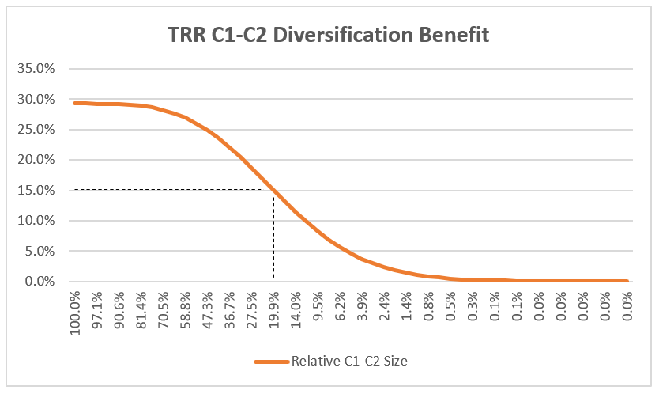

# **Singapore RBC2**

## Solvency Overview

oVERALL Framework
Stress Testing
ORSA
CAR

Local valuation basis >> MCL
CAR, FSR

## **RBC2 Overview**

## **Management Ratios**

The key metric for RBC2 is known as the **Capital Adequacy Ratio** (CAR):

* **Financial Resource** (FR) - Available capital
* **Total Risk Requirement** (TRR) - Required capital

$$
\begin{aligned}
    \text{Capital Adequacy Ratio} = \frac{\text{Financial Resource}}{\text{Total Risk Requirement}}
\end{aligned}
$$

There are two prescribed intervention levels for RBC2:

| **Prescribed Capital Requirement (PCR)** | **Minimum Capital Requirement (MCR)** |
| :--------------------------------------: | :-----------------------------------: |
|   Calibrated at 99.5% VaR over 1 year    |   Calibrated at 90% VaR over 1 year   |
|           1 in 200 years event           |          1 in 10 year event           |
|  Implied investment grade credit rating  |      Implied credit rating of B-      |
|         Capital restoration plan         |           MAS intervention            |

!!! Note

    It is known within the industry that MAS has internal, publicly undisclosed capital targets for each insurer.

## **Risk Requirements**

There are three components to risk requirements:

* **Component 1** (C1): Insurance Risk
* **Component 2** (C2): Asset Risk
* **Operational Risk** (ORR)

$$
    \text{Total Risk Requirements} = \sqrt{\text{Diversified C1}^{2} + \text{Diversified C2}^{2}} + \text{Operational Risk}
$$

It is assumed that C1 and C2 risks are **independent** and thus is **unlikely to occur concurrently** in full force. Thus, there is no need to hold capital to cover both risks completely; there is a **"diversification benefit"** that can be reconized between the two (based on the sum of squares method).

It can be shown that the **maximum diversification** benefit that can be recognized is **about 30%** of the sum of the two components, which occurs when the two risks are **exactly equal**. The larger the difference between the two, the smaller the diversification benefit:

<!-- Self Made -->
{.center}

### **Component 1: Insurance Risk**

Component 1 of the TRR represents the **insurance related risks** undertaken by the insurer by writing policies. Majority of them are calculating by applying the prescribed shock on the best-estimation assumptions

|    C1 Risk    |      Description       |         Application          |
| :-----------: | :--------------------: | :--------------------------: |
|   Mortality   |     Higher deaths      |  +20% Multiplicative Shock   |
|   Longevity   | Lower deaths (Annuity) |  -20% Multiplicative Shock   |
| Dread Disease | Higher dreader disease | +30/40% Multiplicative Shock |
|     Lapse     |    Biting Scenario     | +30/40% Multiplicative Shock |

Different portfolios react differently to lapses, thus the lapse risk requirement is the **highest** of the following three:

* **Lapse Up Scenario**: +50% multiplicative shock to lapses
* **Lapse Down Scenario**: -50% multiplicative shock to lapses
* **Mass Lapse Scenario**: Immediate 30% shock of the entire portfolio ()

Similarly, the different sub-components of C1 are **unlikely to occur concurrently in full force**. Thus, there is a diversification benefit to be recognized, based on the prescribed correlations between the various sub-components:

* **Positive Correlation**: Likely to occur together (Lowest diversification) 
* **No Correlation**: Unlikely to occur together
* * **Negative Correlation**: Cannot happen together (Highest diversification)

Correlation factor of 1 or -1 represents the extreme case of no diversification and fully diversified respectively. Thus, the **magnitude represents the extent** to which the events are likely/unlikely to occur together.

$$
\begin{aligned}
    \text{Diversified C1}
    &= \sqrt{X^{2} + Y^{2} + Z^{2} + 2AXY + 2BXZ + 2CZY} 
\end{aligned}
$$

### **Component 2: Market Risk**

### **Operational Risk**

### **Diversification**

## Financial Resources

Component 1
Component 2
ORR/C3
TRR
FR

Mas breach
Fine
Drop craft rating, pay more PPF > more cost

1 in 200 chance refers to 99.5% var ie 0.05% chance of shit hitting the fan

MAS shocks are calibrated at this level

1 in 200 is basically Z.norm.inv(0.995)

In RBC2 world, there are actually only two funds:

Total Company = SH Fund + Par Fund
SH Fund = ILP Fund + NP Fund + Surplus Account

For the purposes of RBC2, they consider total company CAR using the SH Fund

But Par Fund Solvency is measured using Par Fund (Gated) + Surplus Account

Intuition of CAR

If there is a shock, can your assets support it

Don’t let you count as FRA

ILP not as capital intensive
Par not also because it is subsidised by par fund

SG wants to be a financial hub
So MAS needs to meet the requirements of IMF etc
Need to follow their international standard

But they also want to exercise their own authority in their own basis
They need to do stress test because the international standard is to stress test
Can think of it as their KPI

No value add for stat reporting

There is a fixed format with a correct answer

No changing messaging etc

MAS have to be defensive
Internal can be aggressive
Different styles, different objectives
MAS cannot be wrong

Appointed Actuary > Legal definition, deals with reporting and correspondence with MAS

Chief Actuary > Internal, EV Profit etc

# Valuation

## Valuation & Capital (Stat Reserve)

Best Estimate Liability (BEL) ** Solvency 2 term
Minimum Condition Liability (MCL) ** Liability based on guaranteed benefits only, hence "minimum"
** Regulation is used to describe a Par Product, but the term is used informally to refer to liability of NPAR and Non-Unit Reserve of ILP

Provision for Adverse Deviation (PAD) ** "Buffer" for bad experience
MCL = BEL + PAD
Calculated by shocking the BE assumptions
Assumptions are shocked ALL at once
** Since some assumptions have shocks that go in conflicting directions, must consider all possible combinations
** Typically has to do with Lapse & Mortality
** Lapse Up Mortality Up (LUMU), LUMD, LDMU, LDMD
** Take the scenario which gives the highest liability

Set PAD to 0 during bad times, as it is meant ot be a buffer

# MAS Notice 133 (RBC2)

Solvency Regulation ** ensure that the insurer is holding enough capital
Total Company Level ** Capital Adequacy Ratio (CAR) ~135%
Insurance Fund Level ** Fund Solvency Ratio (FSR) ~135%
** 135 is the official amount, MAS usually requires more
** If fail to hit this value, based on the severity, MAS will require management actions or takeover the company

CAR/FSR = Capital/Total Risk Requirement
** Required Capital is thus the minimum amount of capital needed to fulfil the requirements
** The capital can only be backed by certain kinds of asset class (Gov Debt, Corporate Debt, Equity, Property)
** The proportion of these assets are determined by the Strategic Asset Allocation (SAA)
** It dictates the investment direction of the company (Proportion of assets, similar to Fund Prospectus)
** Using the SAA, the RC can be broken down into the constituent components on how much Debt/Equity/Property the company must hold
** Note that this will in turn affect C2, which changes TRR and hence the asset components again (Cycle)
** Process is repeated iteratively until it reaches equilibrium

Total Risk Requirement (TRR)
** Three different categories
** C1: Insurance Risk
** C2: Economic Risk
** Operational Risk Requirement (ORR)

C1: Insurance Risk
** Mortality, Longevity, Disability, Morbidity etc
** Risk Requirement is calculated for each risk seperately ** C1 Mortality, C1 Longevity etc
** It is calculated similarly to PAD: Individual C1 = Liability with individual assumption shocked - BEL
** Unlike PAD which is determined internally, PAD is a prescribed shock that is the same for all companies (Calculated via industry wide study, based on confidence level. PAD is recommended to be somewhere lower than C1)
** However, need to account for the possibility that some of these risks can occur simultaneously while others cannot > Diversification Benefit
** Calculated by using a correlation matrix with weights for each of the factors (+ve for items that can happen together & -ve for things that cannot)
** Total C1 risk requirement is thus known as the Diversified C1 Requirement
** C1 RR is in excess of PAD ** Since already holding extra capital for insurance risk, dont need double hold

!!! Both MCL and C1 RC must be rebased to the current NOP
** Both are calculated using shocked assumptions (Not true NOP)
** Need to rebase to the true BE NOP
** Divide by shocked NOP to get the "Per Policy MCL/C1" then multiply by the BE NOP to get BE C1/MCL

Risk charge must be "rebased" to the current NOP
Because the RC calculated using the shocked NOP is not the actual portfolio ** rebase to the BE NOP to reflect the actual number of policyholders

(Liability/Basis_NOP)*BE_NOP 

C2: Economic Risk
** Equity, interest etc
** Unique to each risk, no universal way of calculation
** Similar to C1, there is some diversification benefit as well

Most C2 risk charges are not related to liabilities, except interest mismatch
Two scenarios - Interest up and Interest down
Shock the interest by the specified percentage and calculate the change in liability similar to C1

Proxy Factors
** Prophet does not have access to the correlation matrix or the asset data
** Calculated using last months data and find a proxy factor based off MCL

Operational Risk
** Inherent risk in operating a large company
** Larger company tends to have more operational lapses
** Size of the company measured via top line (Premium)
** Penalized based on that amount

Total Risk Requirement
** Diversification between C1 and C2
** Diverisifcation within C1 among Life/Health/GI
** TRR = Diversified C1/2 + ORR

Discount Rate
** Rate that best reflects the underlying risk
** Guaranteed Benefits > Use RFR
** Non-Guaranteed Benefits > Use BEIR (Expected return on the policy assets)

Risk Free Rate
** Split into three segments
** Segment 1: Valuation Date to Last Liquid Point (LLP), use Gov Bonds (20 years)
** Segment 3: Beyond Convergence Point, use Ultimate Forward Rate (Prescribed = Real Interest + Real Inflation, 1.8 + 2 = 3.8%)
** Segment 2: Extrapolated dufring convergence period 40 years between 1 & 3 using the Smith Wilson Method
** Alpha Parameter (Smoothness) chosen via trial and error, does not deviate more than 0.5 from UFR
** Each currency different duration and UFR
** Note that this is the TERM STRUCTURE of interest rates > They represent the spot rates at each time period
** If discounting one period at a time, then it is more appropriate to use the forward rates for each period
** The spot rates can also be used, depending on the method of discounting

RFR Adjustments
#NAME?

IP
** Ill-liquid assets have higher rates of return, thus the insurer should be able to recognise this higher discount rate if they are holding them
** Each type of asset is allocated an IP, overall IP is the weighted average of these IP
** IP is applied as a parallel upward adjustment to the RFR
** For the first 20 years up to the LLP, the insurer must use their own IP
** 10 years after the LLP, the insurer must use an 'ultimate' IP of 10bps
** For the 10 years following the LLP, the insurer must amortize/run off the IP such that is gradually reduces to the ultimate IP
** The rate of amortization is prescribed
** What is the reason behind this? Because the assets are maturing or allocation may change?

RFR_IP = RFR + (IP - Ultimate IP) * Amortization + Ultimate IP
** In early years before LLP, amortization is 100% thus the ultimate IP is cancelled out, only leaving the RFR + IP
** In later years, once the rate is not 100%, it will no longer cancel out and gradually reduce to the ultimate IP

New Business Strain is the negative profit in the first year

Deaths assume to occur middle of month - 
    LAPSE_TMING = 1 means Lapse EOM; die first then remaining ppl lapse
    LAPSE_TMING = 0.5 means Lapse middle OM; compete with deaths

LAPSE supported products
Key difference between MRES_MCL_IF and MRES_MCL_POLLVL_IF is how the lapse is applied
Some lapse are applied at the product level while some is at the policy level
Happens for a few key variables.

Financial Resource side: 
Tier 1 > Asset quality (Functionally hard cash)
Tier 2 > Shit
Negative Reserve > Future Profit, can recognise part of it
