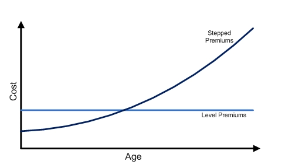

# **Term Life Insurance**

## **Overview**

**Term Life** Insurance provides coverage for a **specified duration**, known as the term of the policy:

* **For specified period** - EG. Multiples of 5 or 10 years
* **Till specified age** - EG. To age 65, 75, 85

If the insured event does NOT occur during the policy term, the policy will expire and **NO benefits will be paid at all**. Thus, term plans are best suited for individuals with financial obligations that only last for a **limited period of time**.

## **Benefit Patterns**

The most common and basic term plan offers **level death benefits** that **do not change** over course of the policy.

The next most common is a term plan with **decreasing death benefits** over time (typically annually). They are designed to meet specific financial obligations that are expected to decrease over time, such as housing mortgage where the **loan balance** decreases with each subsequent payment.

However, decreasing term **typically levels off** at some point (EG. 20% of the starting amount). This is to ensure that the policyholder still has a reason to keep the policy in-force.

!!! Note

    In Singapore, Mortgage Insurance is compulsory when purchasing a HDB, known as the **Home Protection Scheme**.

The least common pattern is one with **increasing death benefits** over time. It is typically designed to increase based on an external index, such a the CPI, to cover for inflation.

!!! Note

    An increasing benefit term policy can be thought of as a combination of:

    1. Level benefit term plan equal to the starting benefit
    2. Level benefit term plan "purchased" each period to account for the increase in coverage

    For the (2), since the additional coverage is "purchased" each period, it uses the mortality cost at that age, which tends to **increase with age**. It is typically cheaper (on whole) if a level premium term was bought with the final coverage from the very beginning.

!!! Tip

    Typically, any change to the benefit level made post-inception requires the insured to go through medical underwriting. However, an increasing benefit plan **guarantees** the increase, without the need for medical underwriting.

<!-- Insert Self Made Diagram -->

## **Premium payment Patterns**

Similarly, **Level term** is the most common premium pattern, where policyholders pay a **constant premium** over the life of the policy, **regardless of their age** at the time. 

The other end of the spectrum is known as **Yearly Renewable Term** (YRT), where the **premiums increase every year**, reflecting the increasing mortality with age.

!!! Note

    It is known as YRT as it is the equivalent price of a one year term insurance that is renewed or bought each year.

It is important to understand the key differences between the two:

* YRT is **significantly cheaper** than level term at younger ages and **significantly more expensive** at older ages
* Individuals are **rarely able to afford** the high premiums at older ages, **forcing them to lapse** the policy when they are **most at risk of death**
* Level term can thus be understood as **pre-paying** (front-loading) future premiums with the advantage of **accumulated with interest** over time, allowing relatively **small level premiums over a long duration** to cover high future mortality costs
* It also provides a **smoothed premium**, allowing policyholders to easily keep the policy inforce, improving policy persistency

<!-- Obtained from RP Wealth Management -->
{.center}

There are several other premium patterns that are a combination of the two approaches:

* **Modified Premium** - Premiums lower than level in the first 3-5 years, then subsequently higher afterwards
* **Stepped Premium** - Premiums increasing every $n$ years

<!-- Insert -->

## **Guaranteed Renewability**

Term plans can offer **Guaranteed Renewability**. This allows the policyholder to **renew the term policy at expiration** to provide coverage again for the same duration. It is meant to provide flexibility for insureds with uncertain **long-term financial obligations** or for those with **difficulty affording** long-term coverage at the moment.

!!! Note

    Upon renewal, the premiums of the policyholder will increase to reflect the higher mortality due to **age** and the **ultimate mortality**.

Health tends to **deteriorate** with age, thus should the insured want to purchase a new policy after the original, they might be **rejected or priced out**. Guaranteed Renewability overcomes this as it ensures the insured retains their coverage WITHOUT needing to go through medical underwriting.

However, such guaranteed renewability features might result in **Adverse Selection**. **Healthy insured** may instead choose to go through medical underwriting to purchase a new plan at a potentially lower rate; leaving **only unhealthy insureds** in the renewed pool. To combat this, some insurers offer a **re-entry** option  that allows policyholders to voluntarily go through medical underwriting upon renewal to obtain lower premiums, **incentivizing** healthy insured to renew as well.

!!! Note

    It is known as re-entry as the policyholder re-enters the **Select Mortality Group** upon renewal.

!!! Warning

    Only select riders that are attachable to the plan can be renewed on a guaranteed basis.

## **Guaranteed Convertability**

Term plans can also offer the option to convert the term policy into **any type of whole life policy** within a specified time frame. The conversion is guaranteed, **regardless of the health** of the insured at the time of conversion. 

!!! Note

    If the resulting whole life plan has **lower coverage** than the existing term plan, the term plan will **continue to be in-force** with the difference in coverage. In this scenario, it is known as a **Partial Conversion**. This ensures **no loss of coverage** during the conversion process.

It is typically meant for insureds who wanted to purchase a whole life policy but **could not afford** to do so at the time. It could also be purchased by insureds who are **unsure of their future financial obligations**, thus would like the option to be able to convert.

Convertibility tends to lead to **adverse selection** as insureds who are healthy have the ability to purchase a potentially cheaper whole life policy **from the market**. As a result, some insurers might offer incentives for these healthy individuals to convert, similar to re-entry.

<!-- Embedded option -->

Commission may only be able on the discounted portion
Promotes persistency, increases sales

Costing
Load only the time of exercise
Load only for the people who want the option
Load for all >> Equity issue because those who use it no longer pay for it, while those who use it still pay forit

Level Premium for decreasing term is problematic because premium is very high for the coverage
Decreasing premium scale

Policy Size Impact
Declining average costs

Very competitive
Need to price competitively for certain cells

## **Pricing Considerations**

### **Lapse & Mortality**

Term products tend to be extremely **price competitive** due to the simplicity of the product, making it easy to compare across insurers. Coupled with the **already low cost**, policyholders tend to **shop around** for term insurance, even if they are already covered, resulting in **relatively higher lapses** compared to other product types. 

Naturally, this option of shopping around is **only available to healthy insureds** who are still insurable at a reasonable rate (able to clear medical underwriting), thus leading to **Adverse Selection** which **negatively impacts mortality** of the remaining block.

!!! Note

    Price competitiveness **further drives down the prices** of term insurance as companies typically aim to **price certain model points more aggressively** (based on their targt market).

Lapse

Premium scale and cells must be competitive
Renewal lapse rates higher than WL

### **Mortality**

All else equal, a term policy will have a higher SAR

Due to the high lapses, term products are often prone to **Adverse Selection**:

* Healthy lives are more likely to lapse when the financial obligation has passed (EG. At the end of the decreasing term)
* Health lives who are confident in going through medical underwriting can afford to switch carriers when **premiums rise** (Shock Lapse) or competitors reduce premiums
* All of these result in mainly **unhealthy lives** that remain in-force

From another perspective,

* Unhealthy lives are more likely to exercise conversion options to whole life, transferring the poor mortality to the whole life block instead
* Due to the high turnover of term policies, most term policies still have the **selection effect**, which should have lower mortality

### **Lapse Supportability**

A **lapse supported** product is one where higher than expected lapses result in higher profitability; the insurer tends to be **better off from lapses**. If policyholders lapse their policy **before the mortality costs increases substantially** above the premium, they have essentially **forfeited their front load** partially or entirely, resulting in **profits for the insurer**.

!!! Warning

    The **timing of lapse** is important. Life insurance policies typically have **high acquisition costs**, that are gradually recovered over the life of the policy. If the lapse occurs too early, the insurer would not have recovered these costs and might result in a loss instead.
    
    Thus, when investigating lapse supportability, it is usually the **ultimate lapse rate** that is of interest; shocking the entire lapse rate downwards might see some offsetting effect from lower lapses.

!!! Note

    Lapse supportability mainly applies to regular premium products. For single premium or limited premium, **lapse rates should be zero** (in the absence of cash values) once the policy becomes paid-up, preventing any possible lapse profit.

Lapse supportability is most prevalent in term insurance given that it has **no cash values**; nothing is returned on lapse. The extent of lapse supportability is dependent on the **size of the front load**. **Term-to-100** is the common example of a highly lapse supported product, due to the high mortality costs at the tail end of life that are front loaded.

!!! Note

    Lapse supportability still exists for whole life insurance as the **cash values paid are often smaller than the front load**, still resulting in profits to the insurer. The extent is dependent on the relative size of the cash value and the front load.

**Lapse supported pricing** refers to **projecting lapses** during pricing, where the insurer **expects to earn lapse profits**. Policies that are projected to lapse are **subsidizing** those that remain in-force, resulting in an overall **lower cost** for the entire portfolio, allowing them to charge **lower premiums**.

The key risk is that this method recognizes profits that have **yet to be earned**. If actual lapse experience emerges (typically much later on) to be **much less than expected**, the profits will never materialize, leading a large **shortfall in reserves**, possibly leading to large losses or insolvency.

Unfortunately, lapse supported premiums tend to be lower, which **increases the perceived value of coverage** which in turn **should lower lapse rates**, working against the  high lapse rates assumed to achieve the lower premiums in the first place.

!!! Note

    For whole life policies, non-forfeiture features typically discourage lapses, which drives lapses lower.
    
    Additionally, the presence of the secondary market may drive it even lower than expected. Rather than lapse their policy, policyholders may sell their policy to a third party for higher cash value.

!!! Note

    Companies cannot simply assume high lapses during pricing; they need **actual historical experience to back the assumption**. Thus, lapses should not be viewed negatively; some degree of lapse support is necessary to remain competitive.

Although lapse supportability results in lower premiums, it represents a **conflict of interest** - policyholders aim to retain coverage while insurers gain from lapses. It is generally deemed unethical to design a product that induces lapses. Thus, it is generally viewed as a **taboo topic** among life insurers.

eXPENSE

Less protected against inflation due to the smaller rserves

Option pricing

Sensitive 