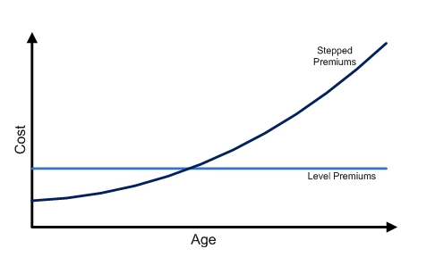

# **Term Life Insurance**

## **Overview**

The most basic type of life insurance is known as **Term Insurance**. As its name suggests, it provides an insurance cover ONLY for a **specific timeframe**, known as the **term** of the policy. Most insurers offer a term plans till a **specified age** OR for a **specified number of years** (usually in multiples of 5 or 10).

If the insured event does NOT occur during the policy term, the policy will expire and **NO benefits will be paid at all**. For this reason, term life insurance has the **lowest premiums** among other life insurance plan types with similar coverage.

!!! Note

    The most basic term plan is one that only covers Death. It is easy to compare these plans across insurers, which makes it **price competitive**, which is another reason why it tends to be cheaper.

Term plans are best suited for individuals with financial obligations that only last for a **limited period of time**, such as during a loan repayment or till a child becomes financially independent.

## **Guaranteed Renewability**

Term plans can offer **Guaranteed Renewability**. This allows the policyholder to **renew the term policy at expiration** to provide coverage again for the same duration. It is meant to provide flexibility for insureds with uncertain **long-term financial obligations** or for those with **difficulty affording** long-term coverage at the moment.

!!! Note

    Upon renewal, the premiums of the policyholder will increase to reflect the higher mortality due to **age** and the **ultimate mortality**.

Health tends to **deteriorate** with age, thus should the insured want to purchase a new policy after the original, they might be **rejected or priced out**. Guaranteed Renewability overcomes this as it ensures the insured retains their coverage WITHOUT needing to go through medical underwriting.

However, such guaranteed renewability features might result in **Adverse Selection**. **Healthy insured** may instead choose to go through medical underwriting to purchase a new plan at a potentially lower rate; leaving **only unhealthy insureds** in the renewed pool. To combat this, some insurers offer a **re-entry** option  that allows policyholders to voluntarily go through medical underwriting upon renewal to obtain lower premiums, **incentivizing** healthy insured to renew as well.

!!! Note

    It is known as re-entry as the policyholder re-enters the **Select Mortality Group** upon renewal.

!!! Warning

    Only select riders that are attachable to the plan can be renewed on a guaranteed basis.

### **Yearly Renewable**

The most extreme version of renewability is for a plan with a **one year term** that is guaranteed renewable; typically known as **Yearly Renewable Term** (YRT). Pure YRTs are often not sold in practice, but serves as a **baseline** for understanding more complex products.

The premiums for a YRT plan **increase every year**, reflecting the increasing mortality with age. Compared to an otherwise equal traditional level premium term plan, the YRT is **cheaper when young but is significantly more expensive when old**: 

<!-- Obtained from RP Wealth Management -->
{.center}

The key difference is that the level premium approach essentially **pre-pays** the premium ahead of time, allowing them to **accumulate with interest** to cover the high mortality costs at later ages, requiring only a reasonably small level premium.

This is in contrast to YRT requires the individual to pay **equal to their mortality cost for that year**. At later ages, most individuals have little to no income, making them unable to afford coverage, forcing them to **lapse the policy when they are most at risk** of death.

In the beginning of life insurance, YRTs were commonly used. However, due to affordability issues, they were phased out in favour of the **smoother level premium** approach that helped with persistency.

!!! Note

    The pre-payment of future mortality cost can also be known as "Front Loading" the mortality costs.

### **Lapse Supportability**

A **lapse supported** product is one where higher than expected lapses result in higher profitability; the insurer tends to be **better off from lapses**. If policyholders lapse their policy **before the mortality costs increases substantially** above the premium, they have essentially **forfeited their front load** partially or entirely, resulting in **profits for the insurer**.

!!! Warning

    The **timing of lapse** is important. Life insurance policies typically have **high acquisition costs**, that are gradually recovered over the life of the policy. If the lapse occurs too early, the insurer would not have recovered these costs and might result in a loss instead.
    
    Thus, when investigating lapse supportability, it is usually the **ultimate lapse rate** that is of interest; shocking the entire lapse rate downwards might see some offsetting effect from lower lapses.

!!! Note

    Lapse supportability mainly applies to regular premium products. For single premium or limited premium, **lapse rates should be zero** (in the absence of cash values) once the policy becomes paid-up, preventing any possible lapse profit.

Lapse supportability is most prevalent in term insurance given that it has **no cash values**; nothing is returned on lapse. The extent of lapse supportability is dependent on the **size of the front load**. **Term-to-100** is the common example of a highly lapse supported product, due to the high mortality costs at the tail end of life that are front loaded.

!!! Note

    Lapse supportability still exists for whole life insurance as the **cash values paid are often smaller than the front load**, still resulting in profits to the insurer. The extent is dependent on the relative size of the cash value and the front load.

**Lapse supported pricing** refers to **projecting lapses** during pricing, where the insurer **expects to earn lapse profits**. Policies that are projected to lapse are **subsidizing** those that remain in-force, resulting in an overall **lower cost** for the entire portfolio, allowing them to charge **lower premiums**.

The key risk is that this method recognizes profits that have **yet to be earned**. If actual lapse experience emerges (typically much later on) to be **much less than expected**, the profits will never materialize, leading a large **shortfall in reserves**, possibly leading to large losses or insolvency.

Unfortunately, lapse supported premiums tend to be lower, which **increases the perceived value of coverage** which in turn **should lower lapse rates**, working against the  high lapse rates assumed to achieve the lower premiums in the first place.

!!! Note

    For whole life policies, non-forfeiture features typically discourage lapses, which drives lapses lower.
    
    Additionally, the presence of the secondary market may drive it even lower than expected. Rather than lapse their policy, policyholders may sell their policy to a third party for higher cash value.

!!! Note

    Companies cannot simply assume high lapses during pricing; they need **actual historical experience to back the assumption**. Thus, lapses should not be viewed negatively; some degree of lapse support is necessary to remain competitive.

Although lapse supportability results in lower premiums, it represents a **conflict of interest** - policyholders aim to retain coverage while insurers gain from lapses. It is generally deemed unethical to design a product that induces lapses. Thus, it is generally viewed as a **taboo topic** among life insurers.

## **Non-Level Benefits**

Term plans cans also offer non-level benefits, with the **ability for the benefit to change** over the lifetime of the policy.

**Increasing benefits** are suited for invididuals with financial obligations that are **expected to increase** over time:

* **Inflation** will increase the price of goods and services over time
* **Lifestyle inflation** where individuals tend to make more expensive lifestyle choices as their income grows
* Parents with kids tend to have **large one-off expenses** due to University or Marriage that occur much later

!!! Note

    An increasing benefit term policy can be thought of as a combination of:

    1. Level benefit term plan equal to the starting benefit
    2. Level benefit term plan "purchased" each period to account for the increase in coverage

    For the (2), since the additional coverage is "purchased" each period, it uses the mortality cost at that age, which tends to **increase with age**. It is typically cheaper (on whole) if a level premium term was bought with the final coverage from the very beginning.

!!! Tip

    Typically, any change to the benefit level made post-inception requires the insured to go through medical underwriting. However, an increasing benefit plan **guarantees** the increase, without the need for medical underwriting.

**Decreasing benefits** are suited for individuals with financial obligations that are **expected to decrease** over time:

* **Loan balance** decreases over time with each payment
* Children **increasingly earn more income** as they enter the workforce, reducing their dependency on parents

!!! Note

    In Singapore, Mortgage Insurance is compulsory when purchasing a HDB, known as the **Home Protection Scheme**.

## **Return of Premium**

Term plans can also offer a **Return of Premium** (ROP), where upon lapsing or expiration the policy, the insured is returned the **total amount of premiums paid till that point**, hence "returning" the premium paid back to them. The feature is typically only available after a specified duration in-force.

This feature is used to **attract customers** who view term insurance as a **waste** as they will not receive any benefit should the insured outlive the policy term. The feature essentially provides a **capital guarantee** on their purchase. It also helps in the **retention** of policyholders as they is **no risk** if they pay premiums; the premium will be returned to them.

!!! Warning

    From an ROI perspective, a ROP feature is actually **loss to the policyholder** as they could have earned interest on the amount had they not paid the premiums in first place.

Life insurance is bought in the unfortunate event that the insured dies during the coverage period. ROP is bought in case the insured survives the coverage period. Thus, ROP as a feature is trying to cover both sides of the mortality-longevity risk. However, if longevity risk is the concern, then it is much better to purchase a **product that specializes in it rather than ROP**.

## **Guaranteed Convertability**

Term plans can also offer the option to convert the term policy into **any type of whole life policy** within a specified time frame. The conversion is guaranteed, **regardless of the health** of the insured at the time of conversion. 

!!! Note

    If the resulting whole life plan has **lower coverage** than the existing term plan, the term plan will **continue to be in-force** with the difference in coverage. In this scenario, it is known as a **Partial Conversion**. This ensures **no loss of coverage** during the conversion process.

It is typically meant for insureds who wanted to purchase a whole life policy but **could not afford** to do so at the time. It could also be purchased by insureds who are **unsure of their future financial obligations**, thus would like the option to be able ti convert.

Convertibility tends to lead to **adverse selection** as insureds who are healthy have the ability to purchase a potentially cheaper whole life policy **from the market**. As a result, some insurers might offer incentives for these healthy individuals to convert, similar to re-entry.

<!-- Embedded option -->

## **Guaranteed Issuance/Insurability**

Insurers also typically offer **Guaranteed Issue** policies which do NOT require medical underwriting, allowing any individual regardless of their health status to obtain coverage. However, there are typically **restrictions** such as lower coverage limits or waiting periods.

It is typically meant for insureds who have **pre-existing medical conditions** that would otherwise be denied coverage. These plans have already priced in the likely higher mortality thus are **more expensive** than an otherwise non-guaranteed plan with identical coverage.

!!! Note

    GIO is applicable to all forms of life insurance, not just term life. Investment policies may be issued on a guaranteed basis as their benefits are not sensitive to the life of the insured.

Guaranteed Issuance could also refer to a feature which allows the policyholder to **increase the coverage** of the plan or **purchase a new life insurance plan** without medical underwriting when certain **key life events** occur (EG. Marriage, Child birth, Child Schooling).

It is meant for insureds who are **unsure of their future financial obligations**, allowing them to **add coverage as and when** these milestones that typically increase financial obligations occur.
