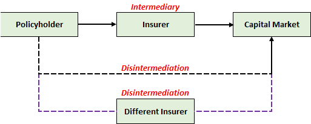

# **Traditional Universal Life**

## **Overview**

Traditional UL refers to the most basic form of UL, where the crediting rate is completely discretionary (subject to any minimum guarantees).

!!! Note

    It is now referred to as “Traditional” in the advent of indexed and variable UL gaining popularity, though it is sometimes just referred to as UL.

## **Crediting Mechanics**

UL policies (like most other products) are typically backed by **fixed income securities**.

The **simplest method** to manage the crediting rate would be to credit the **actual investment return** of the insurer:

* Roll a **short-term** fixed income asset **matching the frequency** of the crediting rate
* Return on the asset reflects the **latest market return** and is directly passed on, less any spreads

This approach is not taken for two primary reasons:

1. **Short-term returns are low** - Insufficient to cover the guarantee, insufficient spreads
2. **Short-term returns are volatile** - Not ideal for all stakeholders
3. Reinvestment risk

Thus, insurers often purchase **long-term bonds** instead that can generate **higher and more stable returns**.

## **Smoothing**

Management of the crediting rate is similar to the bonus of a participating product, since both are **discretionary**

Although returns are locked in using a long term asset, there is a need to manage PRE:

* **Market Rate > Locked In Rate** - May need to credit higher rate to meet PRE (Loss)
* **Market Rate < Locked In Rate** - Able to credit lower rates to create buffers (Gain)

## **Disintermediation**

This creates a mismatch between the policy and the underlying assets backing it.

When **interest rates rise** (beyond the current asset return), if the insurer is **unwilling to raise crediting rates**, there is a high propensity that the policyholder will **lapse** to purchase  **new** investment or policy with the **new higher interest rate**.

When policyholders lapse, assets may need to be sold to fund the payout. However, when interest rates are rising, the market value of bonds drop. Thus, this forces the insurer to recognize a loss:

* Surrender Value - Based on Book Value (Notional AV)
* Bond Sale - Based on Market Value

The risk of lapses during rising interest rate environments is commonly referred to as **Disintermediation Risk**.

!!! Tip

    By buying such policies with an investment component, the policyholder is essentially engaging the insurer as an **intermediary to access the capital market**. When the policyholder withdraws the current policy to purchase a different one, they are essentially **dropping the current intermediary** for another one or even going direct themselves (dis-intermediating).
    
    <!-- Self Made -->
    

    For UL policies, this behaviour is most expected to occur when interest rise. However, the term itself could be used in a wider variety of situations.

Portfolio rates lag
Rates fall, lapses slow down > Dont Asymettrical
Rates fall, crediting falls slower
Cannot let rates fall too low competition >> Peg to competition

Dynamic Lapse Rates >> Pegged to ITM or competitor
