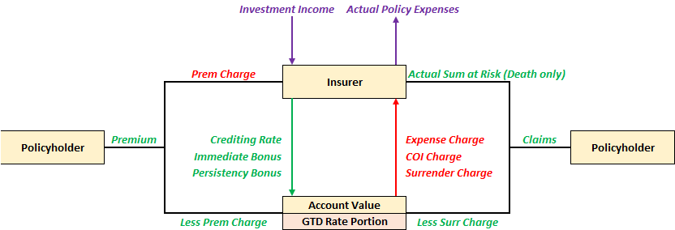
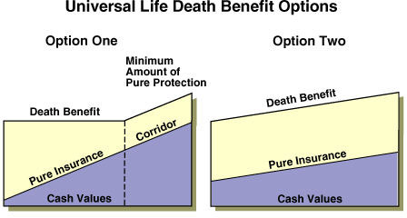

# **Overview**

Universal Life Insurance is a form of **bundled** insurance that has a insurance and investment component:

* **Insurance** - Policy has a **sum assured**
* **Investment** - Premiums are accumulated in an **account which grows with interest** 
* The **Cost of Insurance** (COI) and any necessary **expense loadings** are deducted from the above account. The account balance is the **Cash Value** of the policy

$$
    \text{AV}_{t} = \left(\text{AV}_{t-1} + \text{Premium}_{t} - \text{Charges}_{t} \right) \cdot (1 + r)
$$

Since premiums are not directly used to pay for the insurance, the policyholder is **not required to pay future premiums** to keep the policy in-force. The policy will **automatically lapse** if the account value has **insufficient funds to cover the policy charges** (ie account value is depleted). Policyholders can voluntarily pay additional premiums in any amounts at any time, providing **premium flexibility**.

The policy also allows for the sum assured to be **adjusted post-inception** (subject to any required underwriting). This allows policyholders to effectively **customize** their policy to meet their **specific needs**, which is why it is known as **Universal** life.

!!! Note

    During pricing & valuation, UL policies follow a **premium persistency** assumption to reflect the variability in premium payment. This is similar to the premium holiday assumption for ILPs.

## **Account Value**

The account value of the policy is **notional**, the insurer does not actually have a seperate sub-account for each policy. It is typically known as the **General Account**, as the funds are pooled within the insurer's own general account.

The various components that flows in and out of the account value will be discussed in the subsequent sub-sections.

<!-- Self Made -->
{.center}

### **Planned Premiums**

Given that there are **no strict premium obligations**, policyholders might underfund their policy, which may result in lapsing much earlier than expected. Thus, insurers typically recommend a premium amount that SHOULD be paid each year, known as the **Planned Premium**:

* **Single Premium** - Typically required to pay **proportion of planned premium** to incept
* **Regular Premium** - Typically required to pay the **full planned premium** to incept

The planned premium is typically **calculated** such that, on a best estimate basis, if all planned premiums are paid, then a **specific objective** is achieved (EG. Policy endows at age 100, AV = SA). Thus, it is also known as the **Solved Premium**.

However, if actual experience **adversely deviates from expected**, paying all the planned premiums will be insufficient to achieve the goal. As such, insurers will often also **send reccomendations** midway through the policy to pay additional premiums to better fund the policy. 

!!! Warning

    UL is often marketed as a “whole life” product. However, this is **misleading** because there is **no guarantee** that the policy will remain in-force for life, even if all planned premiums are paid, due to potentially lower crediting rates.
    
    This is contrary to other products where **premium payment guarantees the coverage**. Policyholders might not be able to appreciate the difference in product design and thus feel "cheated" by the insurer.

Policyholders can also pay **MORE than the total planned premium** amount, typically known as **Overfunding** the policy. This will allow the account value to grow faster, allowing the policy to better sustain itself in the long-run. However, insurers typically set an **overfunding limit**:

* **Insurer might be worse off** - Higher account values means lower COI but higher expense charges; net effect dependent on pricing and mix

* **Legal Reasons** - Certain jurisdictions might no longer consider it as an insurance contract and hence lose out on tax or other benefits

Distributors might be incentivized to encourage policyholders to overfund the policy in order to earn a higher commission. Thus, insurers typically set a maximum level (**Target Premium**), such that any premiums above this level (**Excess Premium**) earns commissions at a **reduced rate**. The target premium is typically set **close to the planned premium amount**.

$$
\begin{aligned}
    \text{Excess Premium} &= \text{Planned Premium} - \text{Target Premium} \\

    \text{Total Commission}
    &= \text{Target Premium} \cdot \text{Comm Rate} + \text{Excess Premium} \cdot \text{Reduced Comm Rate}
\end{aligned}

$$

!!! Warning

    In the past, planned premiums used to use the term "Target Premium", which may cause some confusion.

### **Crediting Rate**

The interest credited to the account is known as the **Crediting Rate** (CR). Most insurers provide a non-negative **Minimum Guaranteed Rate** (>0), which ensures that the account value **cannot go down**.

!!! Tip

    It is possible that the crediting interest exceeds the amount of charges in a given period, resulting in a self-sustaining policy. However, this is usually short-lived as the cost of insurance increase exponentially.

Similar to participating products, the CR is determined based on the **insurer's own investment experience** over the period, taking into account **other considerations** as well (EG. Smoothing, Competitiveness etc).

The insurer effectively earns the difference between the actual investment return and the credited rate, known as the **Investment Spread**.

$$
    \text{Investment Spread} = \text{Earned Rate} - \text{Credited Rate}
$$

!!! Warning

    When returns are low, the investment spread will be **compressed** or even turn negative as the insurer still has to meet the minimum guaranteed rate. 

### **Cost of Insurance**

At any given time, the policy will **either** pay out the:

* **Death Benefit** - Equal to the sum assured
* **Surrender Benefit** - Equal to the account value

The excess of the death benefit over the account value is known as the **Sum at Risk** (SAR). It represents the **additional amount** that the insurer will have to pay in the event of death, which is a more **accurate reflection of the coverage** provided by the insurer. The COI rates will be based on the SAR at the time of charge:

$$
\begin{aligned}
    \text{SAR} &= \text{Death Benefit} - \text{Account Value} \\
    \text{COI} = \text{SAR} \cdot \text{COI Rate}
\end{aligned}
$$

!!! Note

    The SAR is also referred to as:

    * Net Amount at Risk (NAAR)
    * Additional Death Benefit (ADB) - Not to be confused with *Accidental* Death Benefit

The COI rates are based on the **current** age of the life insured (attained or S-U scale):

* Guaranteed COI rates
* Adjustable COI rates
* Adjustable with guaranteed maximum COI rates 

!!! Tip

    It is useful to think of UL as a YRT with an account value that funds the premiums.

## **Sales Inducements**

Sales Inducements are product features that **enhances the investment yield** to the policyholder (US SEC definition), intended to assist in the sales process. There are three main types:

* **Immediate Bonuses** (Welcome Bonus) - Paid into account value **immediately** upon inception
* **Persistency Bonus** (Loyalty Bonus) - Paid into account value at the **end of a specified period**
* **Promotional Crediting Rates** - Higher crediting rate for a **specified period**

Immediate Bonuses are naturally guaranteed since they are given on inception, but are also typically subject to some form of **clawback** if certain conditions are met. Persistency Bonuses can be guaranteed or non-guaranteed depending on the product design.

If the bonus is **non-guaranteed**, then the amount of bonus is dependent on the **insurer's experience**. This may result in a situation where **early surrenders subsidize the persistency bonus** of those who remain in-force, creating a **Tontine**, which some **jurisdictions disallow**.

!!! Note

    An issue with the immediate bonus is that it increases the account value from day 1, which decreases the sum at risk and hence COI charges. Depending on the product design, this could have a **decrease in net charges**, which leaves the insurer worse off in the long-run (downstream impact).

    Thus, another popular method is to provide a **Premium Discount** instead, which achieves similar effect but retains the account value.

Promotional crediting rates are typically offered in the form of **guaranteed crediting rates** for a fixed duration. This is also sometimes referred to as a **Locked In Rate**.

Operationally, the insurer must track which premiums are entitled to earn the guaranteed rate. Only premiums paid at the time of the promotion should earn the guaranteed rates; subsequent premiums will earn the regular rates.

* **Guaranteed Account**: Earns guaranteed rates
* **Non-guaranteed account**: Earns non-guaranteed rates
* After the guaranteed period is over, the funds are re-allocated back to the non-guaranteed account

Some insurers also offer the option for the policyholder to **choose their desired guaranteed rate**, typically differing by the guarantee period. Longer better?

## **Death Benefit**

There are typically **two kinds** of Universal Life plans:

|     **Option A/1**     |      **Option B/2**      |
| :--------------------: | :----------------------: |
|  Level death benefit   | Increasing death benefit |
|    Sum Assured Only    | Sum Assured + Cash Value |
| Decreasing sum at risk |   Constant sum at risk   |
|   Required corridoor   |    No need corridoor     |

<!-- Obtained from Wall Street Instructors -->

The SAR represents the **true amount of insurance** coverage provided. To be considered an insurance contract, a minimum level of coverage is required - prescribed through a **minimum ratio** between the death benefit and the account value, known as the **Corridoor Factor**. The SAR required to minimally maintain this ratio is known as the **Corridoor**. If the policy falls below the minimum ratio, the sum assured of the policy will be **increased to maintain the corridoor**.

$$
    \text{Corridoor Factor} = \frac{\text{AV} + \text{SAR}}{\text{AV}}
$$

!!! Note

    The death benefit option of the policy can also be changed post-inception.

## **Surrender Benefits**

The surrender benefit of the policy is equal to the account value, which can be **fully or partially withdrawn** at any time.

Due to the **high costs** associated with setting up a policy, insurers need **several years to recover** the amount from the policy charges. Thus, insurers are left at a loss if a policyholder surrenders early on in the policy. There are two common product designs to deal with this:

* **Back-End Load** - Apply a **surrender charge** (% of AV) that is **deducted from the surrender value** before being paid out; penalizes **only exiting** policyholders
* **Front-End Load** - Apply a **premium charge** (% of Prem) that is **deducted from the premium** before being invested into the account value; penalizes **all** policyholders
* Both charges typically **start high and gradually reduce to 0** over the first few policy years

Premium charges allow the company to more **quickly recover** the costs on inception of the policy, thus are **less concerned** about early surrenders. On the other hand, surrender charges discourage early surrenders, **encouraging the policy to remain in-force** to allow the insurer to recover costs over time.

Premium charges **directly reduce the amount invested**, making it **less efficient** for compounding (increasing the breakeven period), making it **less popular** among consumers these days who are generally much more financially literate. Surrender charges are thus much more common for modern product designs. It is also possible to have a combination of both loads (though each would be applied to a much smaller degree).

<!-- Self Made -->

!!! Note

    Surrender charges for regular premium plans can be as high as 100% in the first few years to fully discourage surrenders.

## **No Lapse Guarantees**

Universal Life was launched in the 1980s when interest rates, and thus projecting credited rates were high. As such, **premiums were lower compared to otherwise equivalent WL** policy, with the added benefit of flexibility.

!!! Tip

    This is why Universal Life has also been referred to as **Interest-Sensitive** life insurance.

However, when interest rates became low down in the 1990s onwards, many of those policies issued in the 1980s ended up being **severely underfunded**, resulting in many account values to deteriorate 0, causing the policy to **lapse**.

Naturally, this resulted in the outrage of many policyholders, with several insurers engaged in major lawsuits.

This prompted a major change in product design, resulting in the creation of **No Lapse Guarantees** (NLG). If the conditions are met, it will allow polices to **remain in-force** even if the account value depletes to 0, **delinking** the policy status from the account value.

If the guarantee is triggered, the UL policy **effectively becomes a term-to-100** as it provides protection with **no cash values** required. UL with NLG is often referred to as **protection** focused UL.

!!! Note
    
    NLGs are also referred to as **Secondary Guarantees**.
    
    Some products may only provide NLG for a fixed number of years or till a certain age.

NLGs are typically designed with one of the following designs:

* **Minimum NLG Premium** - Policy will remain in-force as long as **cumulative premiums paid** are at least **as large as a specified NLG premium**

* Shadow Account

   Once the account value hits 0, the policyholder **must pay** the minimum NLG premium (on a cumulative basis) to keep the policy in-force. This premium will **NOT be used to build account value**; but any excess will.

* **Shadow Account** - A separate account value is projected (known as the “Shadow Account”). As long the as the **shadow account balance is above 0**, the NLG remains active. 

