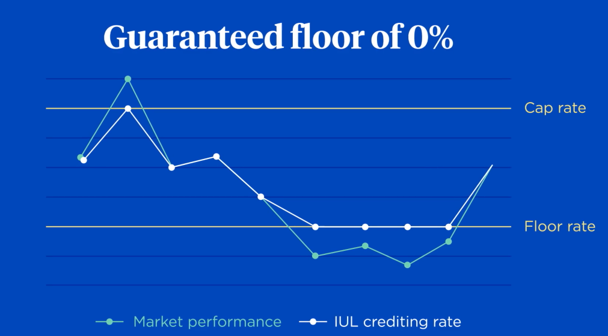
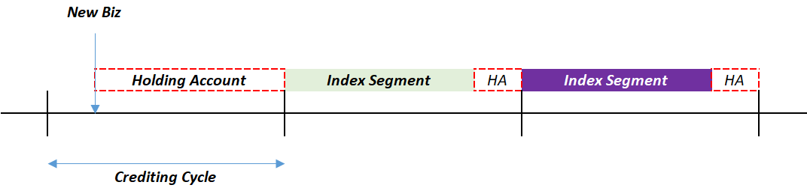
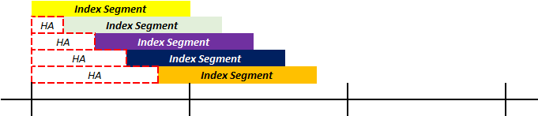
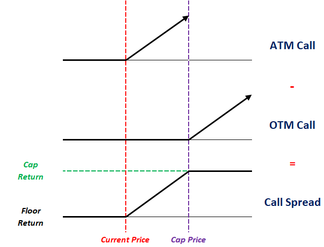

# **Indexed Universal Life**

**Indexed Universal Life** (IUL) is the a variant of UL where the crediting rate is based on the return of a **specified index** (EG. S&P500). The insurer **controls the extent** to which the rate follows the index through the following crediting parameters:

* **Participation Rate** - Proportion of index return to use
* **Cap Rate** - Maximum credited interest, after participation
* **Floor Rate** - Minimum credited interest, after participation (typically 0)

$$
    \text{Crediting Rate}
    = \max [0, \min (\text{Index Return} \cdot \text{Par Rate}, text{Cap Rate})]
$$

<!-- Obtained from Nationwide Insurance -->
{.center}

!!! Tip

    High participation rates (>100%) allows **relatively low performing indices** to also provide a significant return to the policyholder.

Naturally, the **expected crediting rate is higher** than TUL (equities vs bonds), which results in **lower planned premiums** for an otherwise equal IUL plan. All other aspects of the plan remain largely the same as TUL.

## **Index Crediting Mechanisms**

### **Index Allocation**

Policyholders can choose to allocate their funds between a **General Account** (same as UL) and **Index Account**. If premiums are allocated entirely to the general account, it effectively becomes a TUL plan. Thus, insurers often require a **minimum index allocation**. 

Most insurers typically offer a range of indices to choose from based on their desired needs:

* Each index

The index account is then broken down into **multiple sub-accounts** depending on the policyholder’s chosen indices. The crediting rate of each sub-account is based on the return of the corresponding index. Thus, the crediting rate on the entire index account is the **premium weighted average of the index returns**.

Most insurers typically provide a range of indices, each with **their own floor, cap and participation rates**. This allows policyholders to allocate their funds based on their desired risk profile.

### **Index Returns**

The **simplest** crediting mechanism is to use the **Point-to-Point** return methodology, which takes the return based on the index value at the **beginning and end of the segment** (EG. 15 Jan 2026 to 10th Jan 2027):

$$
    \text{PTP Return} = \frac{\text{Index End Value} - \text{Index Start Value}}{\text{Index Start Value}} - 1
$$

However, the above method is **exposed to volatility around the crediting date**, thus another common but **more complicated** alternative is to use the **Average** method, which takes the average daily or monthly **index value** over the segment period to determine the return:

$$
    \text{Average Return} = \frac{\text{Average Index Value}}{\text{Index Start Value}} - 1
$$

Monthly sum? Volatility hurts average method more

The above two are the most common methods. There are many other (exotic) methods of determining the index return:

* **Binary Return** - If condition is met, fixed index credit, otherwise, 0
* **High Watermark** - Return based on **highest** index level over the segment

!!! Note

    Another key point of contention is the crediting rate that is used in **Policy Illustrations**. Similar to Par, this is regulated to prevent insurers from illustrating over-optimistic scenarios.

### **Index Segments**

**Segments** are created to track the **amount of premium following a particular index** during each crediting cycle. Proceeds from the previous segment is automatically rolled into the new segment.

* The account value for **all AVs across all policies** tracking a particular index are aggregated into a Segment 
* Segments are created on the **same days each month**. For new business, premiums will be held in a **holding account** till the next segment creation date
* Segments will typically mature a **few days before** the next segment date. During the transitions, premiums will be placed in the holding account as well 
* Holding accounts typically **earn similar rates** to the general account of the policy
* The crediting parameters (Par, Floor and Cap) are declared **in advance (beginning of segment)**

<!-- Self Made -->
{.center}

In order to smooth crediting rates, some insurers offer a **Premium Spreading** feature where premiums are split into **equal smaller segments**, achieving a **dollar cost averaging** effect:

<!-- Self Made -->
{.center}

!!! Tip

    Most insurers will **limit** the number of segment creations each mont (1-2 times) to ensure that each segment is **sufficiently large** to keep keep **trading costs low** during hedging.

### **Index Hedging**

In order to provide the IUL payoff, the insurer **does NOT actually buy a mutual fund** that tracks the index. Due to the crediting floor, if the actual return of the fund drops below the floor rate, the insurer would **recognize the difference as a loss**. Thus, the insurer instead uses **Options to hedge** the payoff, ensuring that that regardless of market movements, the desired crediting payoff is achieved:

* Buy (Long) **ITM/ATM Call** Option (Strike = Current Price)
* Sell (Short) **OTM Call** Option (Strike = Max Return)
* Combination is known as a **Bull Call Spread**

!!! Note

    When the Index Increases:
    
    1. **Exercise the long call** option to purchase at the initial level and sell at the current level
    2. **Short call assignment** to sell at the maximum level; If the market level is lower than the maximum, no assignment is done
    3. Insurer thus **earns the net difference** between the maximum price (or current price) and the initial price

<!-- Self Made -->
{.center}

The cost of the purchased call will always be higher than the proceeds of the sold call, due to the **lower strike price** (higher chance of profitability). Thus, there will always be a **net cost** to build the hedge.

!!! Tip

    The participation rate is achieved through **leverage** by purchasing **more units of the call spread**. For instance, if the participation rate is 250%, then 2.5 times of the call spread should be purchased. 

In order to **fund the hedge**, the insurer will invest the starting account value into a **bond** that matures at the next crediting cycle and use the return as their **Option Budget**:

* **Bond** - Provides the starting account value on maturity 
* **Call Spread** - Provides the credited interest on maturity

If the option budget is **higher than expected** (after investment spreads and smoothing considerations), the insurer can pass this down in the form of **higher participation rates or higher caps** (buying more options or buying more expensive options).

In practice, insurers might not hegde the entire index account; the extent of the hedge is known as the **Funding Ratio**. This is because some policyholders are **expected lapse**. However, this makes the hedging **lapse supported**, which might cause strain if the assumed lapses do not materialize.

!!! Note

    Hedging via options eliminates the market risk but introduces **counterparty risk**.

### **Interim Values**

Any claims or withdrawals **during a segment** will be based on the **account value without any interest** from the segment, since the interest is only credited at the end. However, some insurers provide **Interim Account Values** during the segment, which is determined either based on:

* Pro Rated
* Replicating portfolio

Lock? - Manual vs Automatic

## **Variations**

## **Volatility Controlled Indexes**

Volatility Controlled Indexes (VCI) are synthetic indexes  that **automatically adjusts** the weight between an underlying specified index and a **low volatility asset class** (EG. Cash, Gold or Fixed Income) to achieve a target volatility level.

The primary purpose of VCIs are to lower the implied volatility of the underlying index, making the position **cheaper to hedge**.

