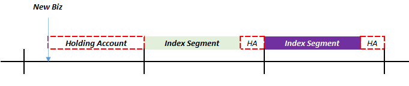
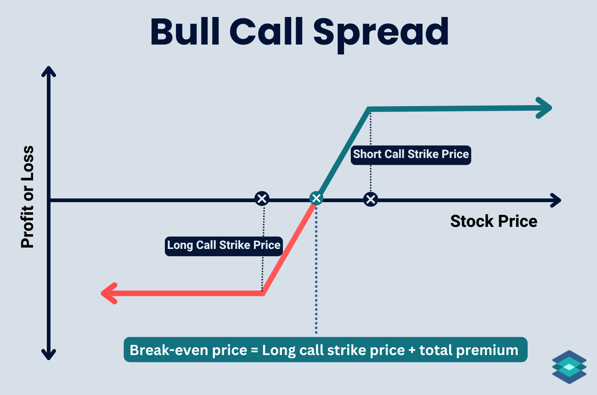

# **Indexed Universal Life**

**Indexed Universal Life** (IUL) is the a variant of UL where the crediting rate is **proportionate** to the return of a **specified index** (EG. S&P500):

* **Participation Rate** - Extent to which crediting rate follows the index return (%)
* **Cap Rate** - Maximum credited interest, after participation
* **Floor Rate** - Minimum credited interest, after participation (typically 0)

$$
    \text{Crediting Rate}
    = \min[\text{Floor Rate}, \max (\text{Index Return} \cdot \text{Participation Rate}, text{Cap Rate})]
$$

<!-- Obtained from Nationwide Insurance -->
{.center}

!!! Note

    The participation rate is typically non-guaranteed, but might have a minimum guaranteed level. High participation rates (>100%) allows **relatively low performing indices** to also provide a significant return to the policyholder.
    
The expected crediting rate of IUL is **typically higher** than TUL due to the nature of underlying assets (Equity vs Bonds). All else equal, this also means that the **planned premium for IUL is lower**.

All other aspects of the product remain largely similar to a traditional UL.

## **Index Crediting Mechanisms**

### **Index Allocation**

Policyholders can choose to allocate their funds between:

* General Account (Same as UL)
* Index Account

!!! Note

    If premiums are allocated entirely to the general account, the policy effectively becomes a UL policy. In practice, insurers often require a **minimum index allocation**. 

The index account is then broken down into **multiple sub-accounts** depending on the policyholder’s chosen indices. The crediting rate of each sub-account is based on the return of the corresponding index. Thus, the crediting rate on the entire index account is the **premium weighted average of the index returns**.

Most insurers typically provide a range of indices, each with **their own floor, cap and participation rates**. This allows policyholders to allocate their funds based on their desired risk profile.
 
### **Index Segments**

**Segments** are created to track the amount of premium following a particular index during each crediting cycle. Proceeds from the previous segment is automatically rolled into the new segment:

<!-- Self Made -->
{.center}

There are several considerations for **operational simplicity**:

* Segments for **ALL policies** are typically created on the **same day each month**. Thus, if a policy incepts before the segment creation date, the premiums will be held in a **holding account**, which earns an **identical rate** to that of the general account.
* Segments actually mature a **few days before** the next segment is created. During this period, the premiums will be held in the holding account as well.

<!-- Self Made -->
{.center}

!!! Note

    In order to smooth returns, some insurers offer a **Premium Spreading** feature where premiums are split into **equal smaller segments**, achieving a **dollar cost averaging** effect:

    <!-- Self Made -->
    {.center}

    The floor, cap and participation rates are applied for **each segmemt**, not the combined return.

### **Index Returns**

The **simplest** crediting mechanism is to use the **Point-to-Point** return methodology, which takes the return based on the index value at the **beginning and end of the segment** (EG. 15 Jan 2026 to 10th Jan 2027):

$$
    \text{PTP Return} = \frac{\text{Index End Value} - \text{Index Start Value}}{\text{Index Start Value}} - 1
$$

However, the above method is **exposed to volatility around the crediting date**, thus another common but **more complicated** alternative is to use the **Average** method, which takes the average daily or monthly index value over the segment period to determine the return:

$$
    \text{Average Return} = \frac{\text{Average Index Value}}{\text{Index Start Value}} - 1
$$

The above two are the most common methods. There are many other (exotic) methods of determining the index return (EG. High watermark etc).

!!! Note

    Another key point of contention is the crediting rate that is used in **Policy Illustrations**. Similar to Par, this is regulated to prevent insurers from illustrating over-optimistic scenarios.

### **Index Hedging**

In order to provide the IUL payoff, the insurer **does NOT actually buy a mutual fund** that tracks the index. Due to the crediting floor, if the actual return of the fund drops below the floor rate, the insurer would **recognize the difference as a loss**.

Thus, the insurer instead uses **Options to hedge** the payoff, ensuring that that regardless of market movements, the desired crediting payoff is achieved:

* Buy (Long) **ITM/ATM Call** Option (Strike = Current Price)
* Sell (Short) **OTM Call** Option (Strike = Max Return)
* Combination is known as a **Bull Call Spread**

!!! Note

    When the Index Increases:
    
    1. Insurer will exercise their option to purchase at the initial level and sell at the current level
    2. Insurer is assigned to sell at the maximum level. If the market level is lower than the maximum, no assignment is made.
    3. Insurer thus earns the net difference between the maximum price (or current price) and the initial price

<!-- Self Made --> 
{.center}

The cost of the purchased call will always be higher than the proceeds of the sold call, due to the **lower strike price** (higher chance of profitability). Thus, there will always be a **net cost** to build the hedge.

!!! Tip

    The participation rate is achieved through **leverage** by purchasing **more units of the call spread**. For instance, if the participation rate is 250%, then 2.5 times of the call spread should be purchased. 

In order to **fund the hedge**, the insurer will invest the starting account value into a **bond** that matures at the next crediting cycle and use the return as their **Option Budget**:

* **Bond** - Provides the starting account value on maturity 
* **Call Spread** - Provides the credited interest on maturity

If the option budget is **higher than expected** (after investment spreads and smoothing considerations), the insurer can pass this down in the form of **higher participation rates or higher caps**.

## **Volatility Controlled Indexes**

Volatility Controlled Indexes (VCI) are synthetic indexes  that **automatically adjusts** the weight between an underlying specified index and a **low volatility asset class** (EG. Cash, Gold or Fixed Income) to achieve a target volatility level.

The primary purpose of VCIs are to lower the implied volatility of the underlying index, making the position **cheaper to hedge**.

* **Variable UL**: Based on the performance of a specific mutual fund

Registered index universal life