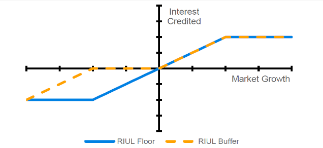

# **Registered Indexed Universal Life**

Another key variant of IUL is known a **Registered Index Universal Life** (RIUL), which has **higher cap rates** with the tradeoff of potentially **negative crediting rates** (more risk, more return). This opens the **possibility of policyholders losing their principal**, thus US regulations require the product to be registered with the SEC; hence it is known as *registered* IUL.

There are two common designs:

* **Floor Method** - Policyholder bears losses up to a **specified floor**; insurer bears the remaining losses
* **Buffer Method** - Insurer bears losses up to a specified buffer; policyholder bears **remaining losses**
* Both methods are **opposite** to one another, just with the parties swapped

<!-- Self Made -->
{.center}

