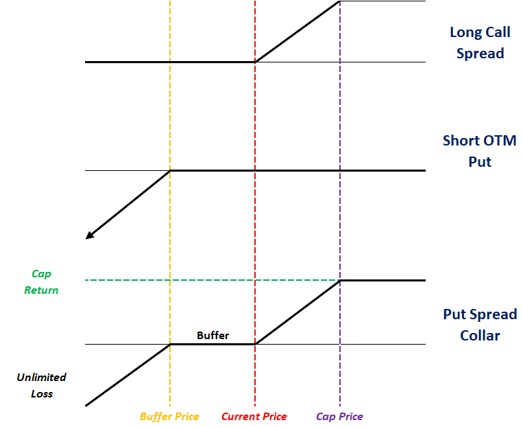
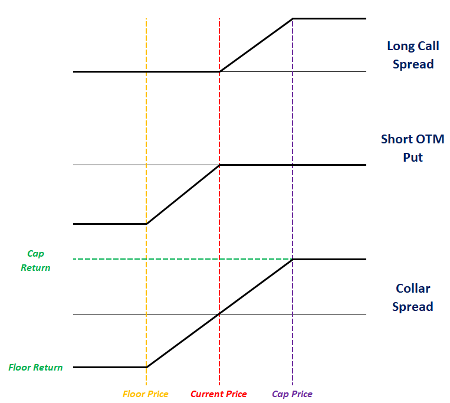
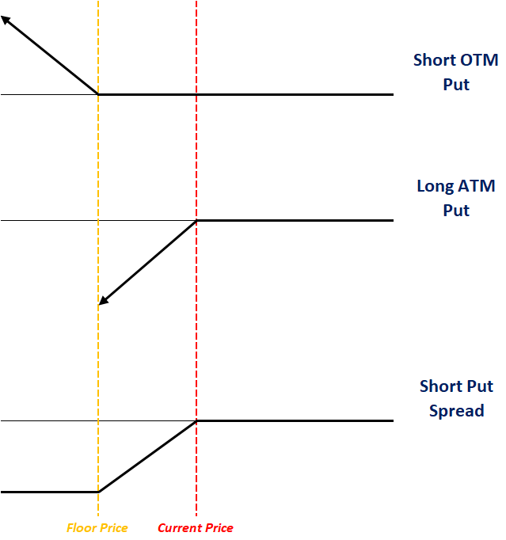

# **Registered Indexed Universal Life**

Another key variant of IUL is known a **Registered Index Universal Life** (RIUL), which has **higher cap rates** with the tradeoff of potentially **negative crediting rates** (more risk, more return). This opens the **possibility of policyholders losing their principal**, thus US regulations require the product to be **registered with the SEC**; hence it is known as *registered* IUL.

There are two common designs, which are essentially opposites of one another::

* **Floor Method** - Policyholder bears losses up to a **specified floor**; insurer bears the remaining losses

$$
    \text{Floor Crediting Rate}
    = \max [\text{Floor Rate}, \min (\text{Index Return} \cdot \text{Par Rate}, text{Cap Rate})]
$$

* **Buffer Method** - Insurer bears losses up to a specified buffer; policyholder bears **remaining losses**

$$
    \text{Buffer Crediting Rate}
    = \min [\text{Cap}, \min (0, \text{Index Return} \cdot \text{Par Rate} + \text{Buffer Rate})]
$$

<!-- Self Made -->
{.center}

RIULs have been growing in popularity due to:

1. **Higher growth potential** than traditional UL or IULs (due to higher index caps)
2. **Lower downside risk** due than VULs (due to floors & buffers)

## **Hedging**

Since the index payoff is largely similar to a regular IUL, the long call spread will be used as a starting point:

* **Floor Hedge** - Addition of a Short Put Spread; resulting in a **Put Spread Collar**
* **Buffer Hedge** - Addition of a Short OTM Put; resulting in a **Collar (spread)**

In both cases, the insurer will have **additional revenue** from the sale of the short put/put spread, which is used to fund the **higher cap** (relative to IUL) from just the call spread.

<!-- Self Made -->
{.center}

<!-- Self Made -->
{.center}

!!! Note

    All else equal, the cap for the buffer design will always be **HIGHER** than the floor design due to the floor design needed to purchase an additional put option, which reduces the budget available for the call spread.

!!! Note

    Short Put Spreads are formed similarly to call spreads:

    * Short ATM Put
    * Long OTM Put

    <!-- Self Made -->
    {.center}