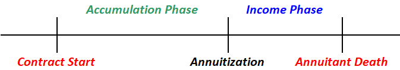

# **Overview**

An annuity is a contract that makes **routine payments** to the beneficiary (Annuitant) for a **specified duration**:

* **Life Annuities** - Payments for as long as the contract holder **remains alive**
* **Certain Annuities** - Payments for a **specified duration**, regardless of the status of the contract holder

Naturally, the focus is on **Life Annuities**. They are meant to insure against **longevity risk**, which is the risk that we **live longer than expected**, outliving our financial resources. The annuity payments are meant to **cover living expenses**, ensuring that we are able to age gracefully. 

The value proposition of annuities is that the insurer is **better suited to manage funds** in a manner that will ensure it **earns sufficient returns such that it does not run dry** before the death of annuitant. Individually, it is difficult to determine how much funds are needed due to the large variance in life expectancy. Via risk pooling, the insurer has a **more stable view of life expectancy** and is thus better equipped to manage the funds in a manner that will **sustain the entire pool**. Modern life annuities also offer **various guarantees** on various aspects of the product that make the value proposition more compelling.

Life Annuities are the **natural hedge** to Life Insurance as they any given person can only either:

* Die too young - Mortality Risk
* Live too long - Longevity Risk

## **Types of Annuities**

There are two main types of life annuities:

|     **Immediate Annuity**      |             **Deferred Annuity**             |
| :----------------------------: | :------------------------------------------: |
|      Single premium only       |          Single or regular premium           |
|  Payments start "immediately"  |          Payments start much later           |
| Premium annuitized immediately | Premium is invested first before annuitizing |

!!! Note

	Immediate annuities do not pay immediately, but rather the **end of the month or year** that the policy is purchased. It is **virtually immediate**, hence it is called such.

Deferred annuities can be understood as the insurer investing the premiums and then using the invested funds to **purchase an immediate annuity** at the point of annuitization. The timing of annuitization differs by product design:

* **Anytime** chosen by the policyholder
* At pre-determined **intervals** (Age, policy year etc)
* At pre-determined **life events** (Retirement, death of breadwinne etc)

Annuities are positioned as a retirement planning tool for working individuals, thus **deferred annuities** are much more common as it allows individuals to make contributions while they are in the workforce and annuitize much later once in retirement.

### **Immediate Annuities**

### **Deferred Annuities**

There are two main phases to a deferred annuity:

* **Accumulation Phase** - Premiums are **invested** by the insurance company
* **Income Phase** - Annuitant **receives payments** for as long as they remain alive

<!--self made -->
{.center}

There are four main variations of deferred annuities, all **deferring based on how the account grows** during the accumulation phase:

* Fixed Deferred Annuities (FDA)
* Variable Annuities (VA)
* Fixed Index Annuities (FIA)
* Registered Index Linked Annuities (RILA)

|       **FDA**        |              **VA**              |       **FIA**        |         **RILA**          |
| :------------------: | :------------------------------: | :------------------: | :-----------------------: |
|   General Account    |         Seperate Account         |   General Account    |      General Account      |
|       Notional       |              Actual              |       Notional       |         Notional          |
|     Fixed growth     |         Variable growth          |   Variable growth    |      Variable growth      |
|  Insurer discretion  | Based on underlying mutual funds |   Pegged to Index    |      Pegged to Index      |
| Non-negative returns |    Possibly negative returns     | Non-negative returns | Possibly negative returns |

Deferred Annuities are conceptually equivalent to Universal Life Insurance - both involve growing an account value which is then used to pay the benefits (lump sum vs income stream). Thus, many of the concepts around crediting rate remain largely similar and will **not be covered again** in the annuity section, unless there are significant differences.

## How do Annuities work?

Policyholders must first decide *when* they would like to start receiving for payments and for *how long*. The date they start receiving payments is known as the **Maturity Date** while the period between the point of purchase till maturity is the **Accumulation Period**.

Policyholders will pay premiums during the accumulation period, where they will then be invested in a fund. The value of the fund on the maturity date is known as the **Accumulation Value**.

Based on the accumulation value, the policy will then determine how much to pay out per month such that the fund value will be fully exhausted during the payment period.

## **Economics**

### **Underwriting**

From the insurer's perspective, they **stand to gain** if the life annuitant **dies earlier than expected** as they would need to **pay lesser than expected**. Thus, they typically **do not require medical underwriting** for annuities; **Guaranteed Issuance**.

!!! Warning

	Given that no underwriting is done, it is NOT appropriate to use a life insurance mortality table for annuities.

There are several interesting trends with regard to mortality:

* **Adverse Selection** - Individuals who purchase annuities generally **expect to live long**. More so for **immediate annuities** rather than deferred (due to saving/investment element)
* **Mortality Improvements** - Mortality tends to **improve over time** due to medical advancements (adverse to the insurer), thus should be considered when valuing annuities
* **Gender Mortality** - Female mortality tends to be lower than males; thus they tend to **pay more or receive less** than for an otherwise equal plan. Due to debates around gener equality, certain regulations have **banned the use of gender based pricing**

### **Annuitization Puzzle**

It was observed that few individuals purchase their own annuities, even though the economics supports it. This is known as the **Annuitization Puzzle**.

Even within the deferred annuities market, very few individuals actually choose to annuitize the policy. Thus, most actually treat it as a **savings or investment vehicle**.

### **Premium Financing**

Leveraged annuities
Policy loan from annuity to buy another protection product
Second policy will make monthly payout afterwards to cover the interest cost of the policy loan
Balance will be used as free cashflow
Policy payout is flat but the interest is variable, typically SORA plus spread

