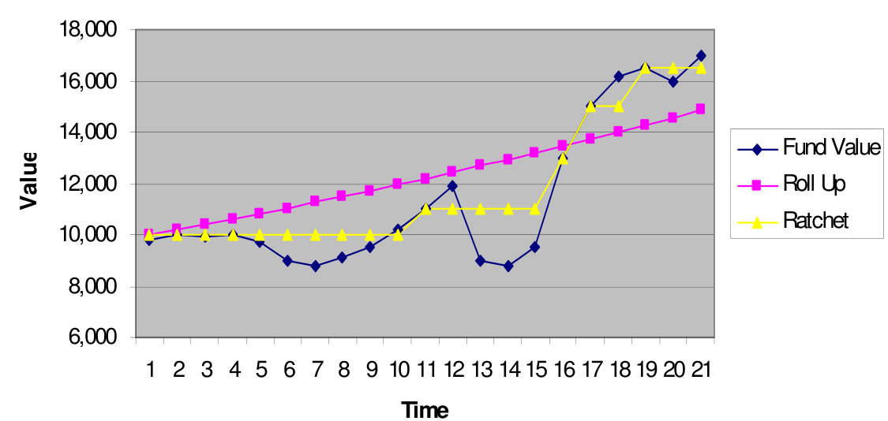

# **Variable Annuities (VA)**

Variable Annuities are **Unit-Linked** annuities, where the accumulation

## **Guarantee Riders (GMxB)**

As previously covered, unit-linked plans often offer **some level guarantees** to limit the downside risks of the plan. For variable annuities, these guarantees are often optional in the form of **attachable riders**. They are called "Guaranteed Minimum XXX Benefit", which is why they are typically refered to as **GMxB riders**.

All the GMxBs function in a similar manner:

* GMxBs create a **secondary guaranteed account**, also known as the **Benefit Base**
* Guaranteed benefits are determined **using the benefit base** instead
* The **higher** of the guaranteed benefit and the non-guaranteed benefit is used

$$
    \text{VA Benefit} = \max (\text{Non-GMxB Benefit}, \text{GMxB Benefit})
$$

### **Benefit Base Designs**

At inception, the benefit base is typically set equal to the account value (same starting point). However, there are three different ways that the benefit base can change:

#### **Reset**

The benefit base can be **reset** at any time to **match the current (higher) account value**:

$$
    \text{Benefit Base (Reset Option)}_{k} = \max (\text{AV}_{k}, \text{Benefit Base}_{k-1})
$$

The same effect can also be achieved by surrendering and buying a new but otherwise identical policy (assuming no surrender charges); the reset option has the added benefit of not incurring the cost of issuing a new policy.

#### **Lookback**

The benefit base is **automatically reset** at periodic intervals if the account value at the time is higher. This is functionally equivalent to taking the **highest account value of every previous interval**:

$$
    \text{Benefit Base (Lookback)}_{k} = \max (\text{AV}_{k}, \text{AV}_{k-n}, \dots, \text{AV}_{k-in})
$$

This is also referred to as a **Step-up Guarantee** (due to the shape if plotted) or a **Ratchet** (due to the adjustable nature).

#### **Roll-Up**

The benefit base **grows with interest** over time, adjusted for premiums and withdrawals:

$$
    \text{Benefit Base (Roll-Up)}_{k} = (\text{Benefit Base (Roll-Up)}_{k-1} + \text{Premium}_{k}) \cdot (1 + r) - \text{Withdrawals}
$$

It is also possible for the benefit base to the **higher of the Lookback or Roll-Up values**:

$$
    \text{\text{Benefit Base}} = \max (\text{Benefit Base (Lookback)}, \text{Benefit Base (Roll-Up)})
$$

<!-- Obtained From -->
{.center}

### **Guaranteed Minimum Death Benefit** (GMDB)

### **Guaranteed Minimum Maturity Benefit** (GMMB)

### **Guaranteed Minimum Accumulation Benefit** (GMAB)

This feature guarantees the **accumulation of account value**. If the **account value is smaller** than the benefit base at the time, the account value is **increased to match the benefit base** (ratchet to the benefit base).

### **Guaranteed Minimum Income Benefit** (GMIB)

This feature guarantees the **annuitization** process:

* Uses **guaranteed annuitization rates** rather than market annuitization rates
* Uses the **benefit base for annuitization** rather than the account value

The annuitization of the policy will be based on the method (guaranteed or market) which produces the **higher payout**.

!!! Note

    This is also refereed to as the **Guaranteed Annuitization Option** (GAO).

### **Guaranteed Minimum Withdrawal Benefit** (GMWB)

This feature guarantees the **amount of (partial) withdrawals** that the policyholder can make, regardless of the account value:

* Total withdrawals **up to the benefit base** (EG. 
* Withdrawals are **capped each year** (EG. 5% of initial premium)
* Guaranteed withdrawal STILL reduces the account value

!!! Warning

    This feature is in relation to partial withdrawals, NOT the income post annuitization.

GMWBs only start to cost the insurer when a withdrawal larger than the account value is made as the insurer has to fund the shortfall.

    