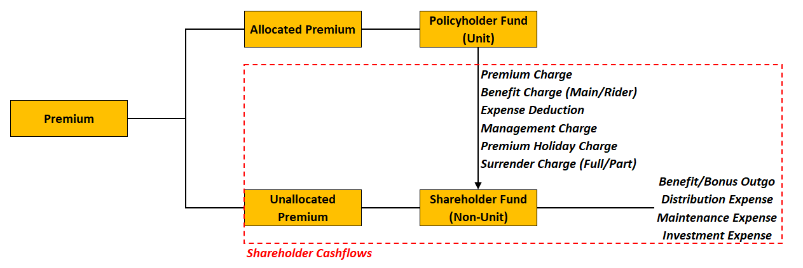
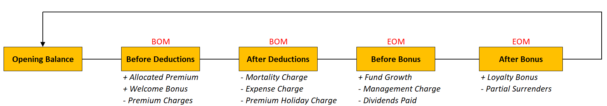

<!-- Self Made -->
{.center}

<!-- Self Made -->
{.center}

BDAD BOP
BB AB EOP

Bid offer spread mechanicsd
Dividend take out rate

INV expense = Fund expense (lower than AMC) + OH
Fund manager gives rebate based on AUM/discsussion