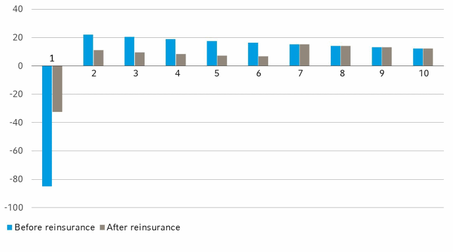

# **Management Reporting**

Management Reporting

This note will largely focus on **Embedded Value** given its prevalence in the industry. However, other metrics unique to the life insurance industry will also be touched on at the end.

## **Embedded Value**

Given the **long-term** nature of life insurance policies where **profits emerge over the policy term**, traditional financial accounting principles failed to accurately represent their profitability. 

This resulted in a low valuation of insurance companies and thus a series of **unwanted acquisitions** in the 1980s. To combat this, **Embedded Value** (EV) was developed to estimate the **long-term profitability** of a life insurance policy and thus provide a more accurate view of the company value from a **shareholder's perspective**.

EV is thus a measure of the **Shareholder Value** of a life insurance company:

$$
    \text{Embedded Value (EV)}
    = \text{Adjusted Net Worth (ANW)} + \text{Value In Force (VIF)} \\
$$

EV is often voluntarily disclosed by the company, which can be used for a variety of purposes:

* **Internal**: Stock price justification, Incentive compensation
* **External**: Mergers & Acquisitions, Comparative Analysis 

### **Type of EV**

The methodology of EV has evolved over time, resulting in three distinct methodologies. Although there is **no central governing entity** on how it is reported, the industry has adopted the guidelines outlined in:

* **Traditional Embedded Value** (TEV): Association of British Insurers (2001)
* **European Embedded Value** (EEV): CFO Forum (2004)
* **Market Consistent Embedded Value** (MCEV): CFO Forum (2008)

TBC to provide high level differences between the types.

This note will largely focus on TEV - but the key concepts are largely transferrable to the other approaches.

### **Adjusted Net Worth**

The first component is known as the **Adjusted Net Worth** (ANW) of the company. It is the **Net Asset Value** of the company, based on the **book values** of the components. However, some **adjustments** are typically made to it to reflect the true economic value of the company:

$$
    \text{Adjusted Net Worth}
    = \text{Assets} - \text{Liabilities} +  \text{Adjustments}
$$

!!! Note

    The book value of the components are often aligned to the latest **published financial report**.

<!-- Self Made -->
{.center}

From an accounting perspective, net assets represent the **shareholder's stake** in the company. However, most **solvency regulations** require the company to hold **additional capital** on top of their reserve, known as the **Required Capital** (RC).

The required capital is still **owned by the shareholders** but is **not distributable** as it is necessary by regulation for the company to operate. The remaining distributable portion of net assets is known as the **Free Surplus** (FS).

<!-- Self Made -->
{.center}

### **Cost of Capital**

Although the required capital is owned by shareholders, it is **locked** into the company and cannot be immediately used for other purposes. When locked in this way, the capital generates **less value to shareholders** than it otherwise would have:

* Shareholders **expect to earn the RDR** on their capital
* However, since it is locked into the company, it can only **earn an investment return** based on the assets that it can be invested in
* Furthemore, since the investment income is earned by the company, it is **subject to tax**

!!! Note

    In most regulations, required capital must be held in **low risk** assets which thus generate **low returns**.

Thus, the above differences creates an **opportunity cost** for shareholders, known as the **Cost of Capital** that is reduced from the value of RC:

$$
\begin{aligned}
    \text{Cost of Capital(t)}
    &= \text{RC} \cdot \text{RDR} - \text{RC} \cdot \text{ABC} \cdot (1 - \text{Corporate Tax}) \\
    \text{PVCoC} &= \text{PV(Cost of Capital)}
\end{aligned}
$$

### **Value in Force**

The other component is known as the **Value In Force** (VIF), which is the **present value of future profits** from the in-force block of business.

Profits in a company can either be **reinvested** back into the business or **distributed to shareholders** via dividends. VIF assumes that future profits are **entirely distributed** to shareholders, thus is counted towards EV.

$$
    \text{VIF} = \text{PV(Profits)} - \text{PV(CoC)}
$$

### **Risk Discount Rate**

Shareholders took on risk to invest in the company. Thus, they require a rate of return **higher than the risk free rate** (RFR) to reflect the underlying risk of the company. It is commonly referred to as the **Risk Discount Rate** (RDR).

The RDR will be used as the **basis for discounting** as it represents the **minimum return** that the shareholder expects.

In most jurisdictions, Debt cannot be used to support capital requirements. Thus, the RDR is determined using the **Cost of Equity**, which is usually determined via the **Capital Asset Pricing Model** (CAPM) or its variants:

$$
    \text{RDR}_\text{Equity}
    = \text{RFR} + \beta \cdot (\text{Market Return} - \text{RFR}) 
$$

!!! Note

    If Debt is allowed in some capacity, then the **Weighted Average Cost of Capital** (WACC) can be used instead:

    $$
        \text{RDR}_\text{WACC}
        = \text{RDR}_\text{Equity} \cdot \left(\frac{E}{E+D} \right)
        + \text{RDR}_\text{Debt} \cdot \left(\frac{D}{E+D} \right)
    $$

### **Future Profits**

An implicit assumption made is that there are future profits that **will emerge** over the life of the policy.

!!! Note

    This applies to **both positive and negative** profits. It simply means that the profits will not remain at zero throughout the life of the policy.

To understand why profits will emerge, consider the expression for profit:

$$
\begin{aligned}
    \text{Profit(t)}
    &= \text{Premium(t)} - \text{Expenses(t)} - \text{Benefits(t)} \\
    &+ \text{Investment Return(t)} - \text{Increase in Reserve(t)}
\end{aligned}
$$

Prem
Exp (Comm, fixed + var, init + ren)
Ben (Death, Surr, Mat)
- RI Prem (Pay to RI)
+ RI Rec (Claims that can be ceded to RI)
+ RI Comm (Paid to the Direct company, to cover the underwriting and acq costs associated with the policy, since the RI themselves did not acquire business)

If reserves are calculated on the **same basis** as the projection, then there will be **NO profit** as the terms will **cancel** each other out:

* **Release of reserves** to cover the expected** net benefit and expenses; offsetting the net premiums received in the period
* **Increase in reserves** due to the unwinding** of discount; offsetting the investment income earned on the same amount

!!! Note

    Unwinding is the **reversal** of discounting. Consider the following:

    1. The discount rate is 10%
    2. There is a cashflow of $121 in **two years** time
    3. The **present value** of this cashflow **today** is $100

    In **exactly one year**, the present value of the cashflow will be $110. The present value increases because there is **one less year of discounting** (all else equal). The **increase in present value over time** is known as the **Unwinding** for that period.

However, most regulations require reserves to be calculated on a more **conservative basis** to ensure that the reserves are sufficient even if actual experience deviates significantly from expected:

* BE rates are **loaded** with risk margins (PAD)
* Cashflows are discounted at the **RFR**; reserves expected to earn ABL rate

Thus, a **difference in basis** between the projection and reserve will cause **profit to emerge** from the policy:

* **Change** of reserves will be **different** the expected benefits and expenses (net of premiums)
* **Unwinding** of reserves will be **less than** the expected investment income

EV is calculated on a **best-estimate basis** while reserves are calculated on a **conservative basis**, resulting in emerging profits.

In practice, companies must also pay **corporate tax** on their profits. Thus, **Profits After Tax** should be considered instead:

$$
\begin{aligned}
    \text{Profits after Tax} &= \text{Profits} - \text{Corporate Tax} \\
    \\
    \therefore \text{PVFP} &= \text{PV(Profits After Tax)}
\end{aligned} 
$$

!!! Note

    This is another reason why profits will **not be zero** - taxes are usually **not accounted** for in the reserve.

### **Shareholder Profits**

Based on the above components, EV can be expressed as the following:

$$
    \text{EV}
    = \text{FS} + \text{RC} - \text{PV(CoC)} + \text{PV(Profits After Tax)}
$$

Rather than calculating the last three components seperately, it can be calculated **directly** by considering the **Profits to Shareholders**:

$$
\begin{aligned}
    \text{Profits to Shareholders}
    &= \text{Profits After Tax} \\
    &+ \text{Investment Income on Capital} \\
    &+ \text{Tax on Investment Income} \\
    &- \text{Change in RC} \\
    \\
    \therefore \text{EV}
    &= \text{FS} + \text{PV(Profits to Shareholders)} \\
\end{aligned}
$$

The key is to understand that similar to PAD, the RC is not needed to support the policy benefits. Thus, it will **gradually be released** over the life of the policy. The value of the RC is thus captured via the PV(Change in RC) component.

Since it is released over time, the RC is also **expected to grow**:

* Expected to grow by the RDR but only earns the post-tax ABC
* Grows by the post-tax ABC but **discounted by the higher** RDR
* PV of the RC decreases below its original value - difference is the **Cost of Capital**

Thus, the CoC can be quantified in a different manner as the difference in the two profits:

$$
    \text{PV(CoC)}
    = \text{PV(Profits to Shareholders)} - \text{PV(Profits After Tax)}  
$$

### **Par Products**

Due to the unique properties of the participating fund, EV is calculated in a different manner:

1. There is no CoC (VIF = PVFP)
2. ANW is replaced by Estate
3. Profits are recognized differently

$$
    \text{EV} = \text{Estate} + \text{PVFP}
$$

Specific details on par fund management can be found in its respective set of notes. For this section, it is sufficient to understand the following:

* Par Fund assets are strictly **ring-fenced** from the rest of the company
* Net assets of the fund is known as the **Surplus** of the fund from which bonuses are paid
* An additional amount up to 1/9th of the bonus declared can be **transferred to shareholders** into a **Surplus Account** within the par fund

Transfer + Res prof
Transfer is the yearly trasfers based on current bonus rate
However, the current bonus rate may not fully exhaust the profit > Will have some spare profit > Residual Profit

No coC because assumed that it is self sustaining, shareholders do not need to set up capital for it
Link to NB strain

### **Analysis of Movement**

The most important aspect of EV is not the value at any particular time, but rather **how it changes** from one period to another (usually one year). The process of breaking down the changes in EV into different Attributions is known as the **Analysis of Movement** (AoM):

The AoM is often more important than the actual EV itself, as it provides **actionable management information**:

* Identifies **key drivers** of value
* Identifies areas for **assumption review**

There are many ways of decomposing the movement that may be unique to each company's business profile. This section aims to cover the **main attributions** that will be part of every AoM:

|                   |  ANW  | PV(Profits) | PV(CoC) |   EV    |
| :---------------: | :---: | :---------: | :-----: | :-----: |
|    **Opening**    |  $A$  |     $B$     |   $C$   | $A+B+C$ |
| **Attribution 1** |
| **Attribution 2** |
|        ...        |
|    **Ending**     |  $X$  |     $Y$     |   $Z$   | $X+Y+Z$ |

!!! Note

    The impact to PV(Profits) and PV(CoC) is *straightforward* as they are directly calculated in the projection. For ANW, consider its definition:

    $$
        \text{ANW} = \text{Assets} - \text{Liabilities}
    $$

    Assuming that there

#### **Stepwise Approach**

There are two methods to attribute the movements:

1. **Independent**: Changes made in **isolation**; model resets after each component
2. **Stepwise**: Changes made **incrementally**; model does not reset

Generally, the stepwise approach is better as it accounts for **interdependencies**, allowing for the correlation among components to be reflected.

Starting from the previous result, **only one component** is added on at a time **incrementally** to determine the impact of that component, till the final result is reached. If the attribution from one step to another is large, **external analysis** performed outside the model to further explain the impact.

**Different sequencing** of components will lead to a slightly **different attribution** for each component as it affects where the **correlation impacts** are parked under - overall movement remains unchanged. Thus, a sequence that is operationally easier to execute is often chosen.

#### **Model Changes**

Over the year, the model used for projection will naturally be updated with new methodologies or to correct errors, naturally leading to some **small variation** in results.

Similarly, **assumptions** would have been reviewed and updated based on the latest experience, resulting in **some impact** to the results, all else equal. It is usually **broken down** into several minor steps for each type of assumption changed:

1. Mortality, Morbidity & Lapse
2. Commission & Expense
3. Investment Return on assets/funds
4. Discount Rate
5. Risk Free Rate & Exchange Rate

#### **Expected Return from Existing Policies**

When moving from one year to another, there are a few items we expect to change.

Firstly, is the **transfer of profits**. Based on the opening position, the company expected to earn some profit in the first year of projection. Now that the year has passed, the company expects to **realize these profits** and thus they should no longer be classified under PV(Profits) but instead transferred to **ANW**.

!!! Note

    This is a reclassification from "future earning" (PVFP) to "earned" (ANW). The impact on both should be **equal and opposite**, resulting in **no change** to total EV.

Secondly, is the **unwinding** of the interest. Moving one year into the future, we expect our assets and liabilities to grow:

|          Assets           |       Liabilities        |
| :-----------------------: | :----------------------: |
| Earn one year of interest | Discounted one year less |
|  Roll-forward using BEIR  |  Roll-forward using RDR  |
|            ANW            |  PV(Profits) & PV(CoC)   |

!!! Warning

    An easy way to quantify this impact is to take the difference between:

    1. Opening Projection (t=0)
    2. Opening Projection (t=12)

    However, the first component **contains the first year cashflows** as well. Thus, that should be removed to ensure that the difference contains the impact purely due to the unwinding AND to ensure that there is **no double counting** with the transfer of profit.

#### **Expected Return from New Business**

New Business written over the year becomes **part of the in-force block** and is thus **under the scope of EV**. The EV generated from the block of new business is known as the **Value New Business** (VNB).

Details about how VNB is computed can be found under its respective section. For the purposes of AoM, it is sufficient to know that **regardless of when** the business was written in the year, it is commonly treated as being **just incepted** on the valuation date (Duration In Force = 0).

An implication of this is that the **entire EV of the business is parked under PV(Profits)**, when it should not be:

* Upon inception, the entire policy EV is captured under the PV(Profits) and PV(CoC)
* After one month, one month's worth of profits should be **transferred** from PV(Profits) to ANW
* Similarly, there is **unwinding** of the monthly earned interest and discount rate

!!! Note

    For instance, consider a policy **incepted in September**. At the **end of the year**, the policy should have:

    * 3 months of expected profits earned in ANW
    * 9 months of future profits in PV(Profits) and PV(CoC)
    * 3 months of unwinding

Notice that this is the **same process** as what was done for the existing in-force block, just at a monthly level rather than yearly.

At this point, all the **expected changes** in EV have been covered. Thus, the remaining change represents **unexpected changes** that require **further investigation**.

#### **Experience Variance**

The most common approach taken to explain the difference is to **compare actual experience with expected**. This attribution is often referred to as **Experience Variance**.

Due to the sheer number of assumptions made in the model, only a few **critical assumptions** are analyzed. Among them, they are typically broken down into the following components to provide greater insight:

|       **Economic**        |     **Non Economic**      |
| :-----------------------: | :-----------------------: |
| Out of management control | Within management control |
|    Little can be done     |    Action can be taken    |
|    EG. Risk Free Rate     |        EG. Expense        |

For **non-decrement** related assumptions (EG. Expense or Investment Income), the variance can be determined as:

$$
    \text{Variance}
    = \text{Reported Value in P&L} - \text{Expected value in projection}
$$

This variance is attributed entirely to **ANW** becuase it is concerning cashflows that have already occurred.

However, for **decrement** assumptions (EG. Lapse and Mortality), there are **two effects**:

* **Current Year**: Paying more death benefit than expected
* **Future Years**: Fewer policies in-force in future years (Impact to Reserves & Future Profits)

The **current year** effect is determined in the same way as the non-decrement assumptions - comparing what was actually paid against what was expected.

The **future year** effect is complicated because it is hard to isolate the effect that multiple

Multiple decrement, hard to isolate the effect from just lapse/death

#### **Capital Movements**

Any changes in capital over the year will affect EV:

* **Dividends**: Paid using free surplus; reduces ANW accordingly
* **Capital Injections**: Added into required capital; increases VIF accordingly

#### **Unexplained Movement**

Any remaining amount of EV movement that is not captured by the above attributions is referred to as the **unexplained movement**.

It is expected that there will be **some degree** of unexplained movements as not all variances can be captured. That said, the unexplained movement should only form a **small proportion** of overall movement.

HOWEVER, investment return on Assets backing liabilities DO NOT COUNT TOWARDS SHAREHOLDER VALUE
this is because the investment return on this item is expected to support the policyholder onligation (sINCE BEL is discounted liabilities, expected earning rate is already accounted)

## **Value New Business**

No real reason to model NBEV correctly because there is no incentive to do so since the total VIF remains the same

## **Operating Profit**

## **Annual Premium Equivalent**

**Annual Premium Equivalent** (APE) is used a **measure of sales** for a block of policies, typically used as a measure of **new business** sales.

Due to the different types of premium modes available (Regular, Limited & Single), the **magnitude** of the premium **cannot be taken at face value**. Thus, APE aims to **standardize** each premium to an **equivalent regular premium amount** so that they can be aggregated together.

It assumes that a standard life insurance policy has a 10 year premium term - Single and regular premiums are thus **scaled linearly** to match this 10 year term: 

$$
\begin{aligned}
    \text{APE} &= \text{Premium} \cdot \frac{Premium Term}{10} \\
    \\
    \text{Total APE}
    &= \text{Regular Premium} \\
    &+ \text{Limited Premium} \cdot \frac{Premium Term}{10} \\
    &+ \text{Single Premium} \cdot 10%
\end{aligned}
$$

!!! Info

    10% is often directly used in the formula for single premiums since it is fixed that they will only **pay one year** of premiums - which will always result in a 10% scaling.

The above scaling is not perfect - it does not account for the difference in time value of money. However, the difference is often **negligible** and outweighed by the **simplicity** of the linear approach.

APE is the preferred method of measuring of sales as it takes into account both the:

* **Size** of policies
* **Mix** of policies between RP, LP & SP

## **New Business Strain**

Life Insurance policies typically incur a **negative profit** in the first year it is sold, known as the **New Business Strain** (NBS). This is due to the premium in the first year being **insufficient to cover** the high upfront costs of setting up a policy:

* Selling Expenses
* Establishing Reserves and Required Capital

It is typically expressed as a **percentage** of the premium received:

$$
    \text{NB Strain} = \frac{Negative Profit}{Premium}
$$

From an accounting perspective, writing new business immediately **reduces the solvency** of the company as the shortfall is funded from shareholder capital. However, profits will be recovered over time:

<!-- Obtained from Hannover Re -->

NBS is important because all companies strive to write more business - thus, it is important to minimize the strain created so that new business can be written more efficiently, without severely impacting solvency.

## **Payback Period**

The Payback Period is the time taken for the policy to **breakeven**; recover its NBS. It is a measure of **how fast** profit from the policy will emerge.

It is deter

## **Internal Rate of Return**

