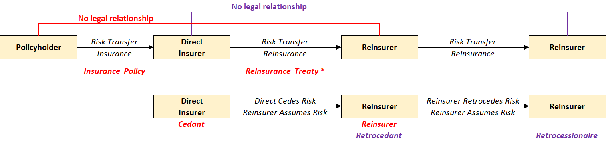
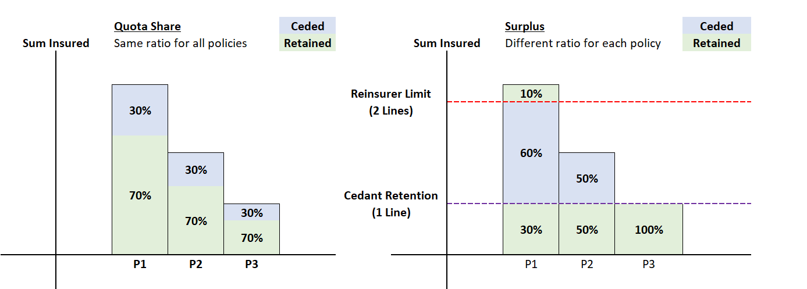
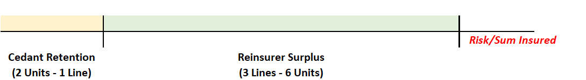

# **Reinsurance**

Reinsurance is the **transfer of risk from an insurance company to a reinsurance company** with the payment of a reinsurance premium to the reinsurance company for taking on the risk. Reinsurance company themselves are an insurance company, thus they **can also reinsure** out their risk to yet another reinsurer.

!!! Note

    It is essentially "insurance" for an insurance company.

There are several **new terms** used in the reinsurance context summarized in the diagram below:

<!-- Self Made -->
{.center}

There are several other key points to note:

* Direct Insurers typically **do not transfer ALL** the risk they have assumed. The portion kept by the direct company is known as the **Retained** portion (versus the **Ceded** portion transferred to the reinsurer)
* For any particular risk, direct insurers can also work with **multiple reinsurers** at once, where each reinsurer assumes a different portion of the risk

## **Reinsurance Uses**

There are two types of reinsurance arrangements, split based on their purpose:

* **Traditional** reinsurance - **Risk Transfer**
* **Financial** reinsurance - achieve a **specific business objective** such as capital management. These arranegements typically involve **little risk transfer** (if any at all)

## **Types of Insurance**

### **Indemnnity vs Assumption**

**Indemnity** reinsurance refers to agreements where the reinsurer **indemnifies (reimburses)** to the ceding company for the ceded share of the claims. The insurer is still liable to the policyholder even if the reinsurer defaults; the reinsurer has **no contractual obligation** to the underlying policyholder.

**Assumption** reinsurance refers to agreements where the reinsurer assumes all responsibility. This is a form of **Novation** where the **reinsurer replaces the insurer** in the underlying insurance contract. The insurer is effectively **selling the specific block** of insurance to the reinsurer.

!!! Warning

    Fully ceding out under an indemnity arrangement is **NOT the same as Novation**; the key distinction lies in which party is liable to the underlying policyholders.

### **Facultative vs Automatic**

**Facultative** reinsurance refers to arranegements where the ceding company has the **faculty (discretion)** to determine **which risks to cede** and the reinsurer also has the **faculty to decide whether to assume** the risk post examination. 

**Automatic** reinsurance refers to arranegements where the ceding company **automatically** cedes all risks that fulfil an agreed criteria and the reinsurer is **obliged** to assume the risks. Hence, it is also known as **Obligatory** reinsurance or **Treaty Reinsurance**.

Insurers typically utilize both types in conjunction:

* Auotomatic arrangements to cover the bulk of the risk
* Facultative arrangements to cover **specific risks** that were excluded from the automatic portion

### **Proportional vs Non Proportional**

**Proportional** reinsurance refers to arrangements where the ceded amount is based on a **proportion (ratio)** that is contractually defined based on the ceded risk. There are two common designs:

* **Quota Share** - All risks share the **same ratio**
* **Surplus** - Ratio is **determined seperately** for each risk

!!! Tip

    Proportional reinsurance is also referred to as **First Dollar Reinsurance** because there the coverage starts from the first dollar, no minimum requirements must be met.

<!-- Self Made -->

Surplus arrangements typically define two levels:

* **Cedant Retention** - Known as the **Line**
* **Reinsurer Limit** - Multiple of the retention (EG. 5 Lines = 5 times the retention limit)

$$
    \text{Surplus Ratio} = \frac{\min (\text{Reinsurer Limit}, \text{Policy Sum Insured} - \text{Cedant Retention})}{\text{Policy Sum Insured}}
$$

<!-- Self Made -->
{.center}

QUOTA Share >> Simple but does not properly address specific needs
They do not balance portfolios because high coverages are still reduced by the same amount
Well suited to manage random fluctuations or risk of change
Does not protect against catastrophe
Does not protectagainst imbalances
Not flexible

Surplus Reinsurance
Good at balancing
Complicated to manage

**Non-Proportional** reinsurance refers to arrangements where there is **NO pre-defined ratio**. They function similar to Surplus arrangements with the cedant and reinsurer's limits, but is based on **actual losses** rather than risk. There are two common designs:

* **Excess of Loss** (XOL) - Per loss or Per Event
* **Stop Loss** (SL) - Aggregate losses over a specified period

Layers?

## Why Reinsruance

## **Reinsurance Cashflows**

There are four main reinsurance cashflows:

1. Reinsurance Premium - Amount that the insurer pays to the reinsurer for the coverage
2. Reinsurance Recoverable - Amount that the reinsurer indemnifies the insurer in the event of a claim
3. Reinsurance Commission - Amount that the reinsurer gives to the insurer to offset 
4. RI Profit Cm

RI Commissions >> Initially meant to compensate the insurer for expenses associated with writing business

Protection in case of catastrophe
Manage losses
Underwriting capacity

Need to be homogenous
Unbalanced Portfolios >> Huge exporue arises from a relatively small number of objects

Reinsurance is used for capital management
Company growing quickly > Need more capital than steady state
Prefer not to use internal capital to support that growth > rather invest in other aspects
cede part of business to reinsurers to reduce capital demands > as growth slows, reduce the ceded portion and move back to 0 position

Reinsurance is global in natrure, very easy to move capital around

Reinsurance
What is Reinsurance?

o	Important that Reinsurance companies do not eventually form a circular loop where a reinsurer is reinsuring part of themselves
o	However, reinsurance may be provided for by another company in the corporate group. In this case, it is known as Captive Reinsurance
•	Thus, instead of Retroceding to another Reinsurance Company, they could Retrocede the risk to the Capital Markets instead in the form of Insurance-Linked-Securities (EG. Catastrophe Bonds)

Why Reinsurance?
•	Consider from an insurance company’s perspective, why they would want Reinsurance:
o	Precisely manage their risks. Insurers can choose which risks they want to retain and cede out the portion they don’t want to. This can be beneficially when trying to manoeuvre around regulatory solvency requirements
o	Stabilize business results. Instead of the potentially having high frequency or large claims, it is replaced with a fixed premium. This makes performance more predictable which could have tax benefits or relaxed capital requirements
o	Increase underwriting capacity. Since only a portion of the risk is actually assumed by the insurer, they can afford to write risks that would have otherwise been too big. This ensures that most events are insurable at an affordable price
o	Protect against Catastrophe Losses. Catastrophes often hit an entire region at a time, which would instantly bankrupt an insurer as their risks tend to be concentrated in a particular region. However, Reinsurers operate globally; thus they can afford to reinsurer for Catastrophe Risks
•	Reinsurance tends to focus more on the General Insurance side of things given the large risk that they write. However, there are trends in the Life Insurance side as well in the form of Financial Reinsurance

Captive Insurance
Setting up another insurance company to insure against your own losses
Main benefit is mainly capital constraints, tax, funding etc
Regulated alternative to self insurance > Less tempted to take the money
Offer direct access to reinsurance and act as an investment vehicle

The problem with that approach is its lack of a formal structure, creating the temptation to access the funds for other purposes and ambiguity about how much coverage a firm actually has.
With a captive, on the other hand, the funds are segregated and held in a regulated, audited vehicle, which can help the firm go out and attain more cover from the reinsurance market. To be clear: the captive would insure only its parent company, not competitors.

aid over the years his firm has been quoted insurance many times at prices which were “ridiculous and obscene.”

If pricing is too high in the commercial insurance markets or no underwriters are willing to cover a firm’s risk, captives are used to formalize self-insurance with reporting on capital and reserve requirements. 

Captives are typically set up for more niche products (though not always) so I suppose the only disadvantage is if you work on some niche product at a captive and then later that work doesn't translate to other more general career options. > Hard to get priced

Other points
•	Reinsurance contracts typically mirror the terms & exclusions of the underlying risk it is insuring
•	Since Reinsurance is a contract surrounding two professional entities, the guidelines and regulations are very different compared to primary insurer
•	Financial Reinsurance is a very up and coming thing

All the terms is captured under the Treaty binding agreement