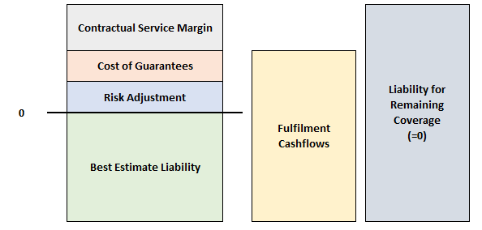
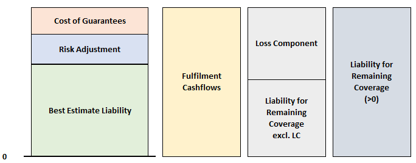
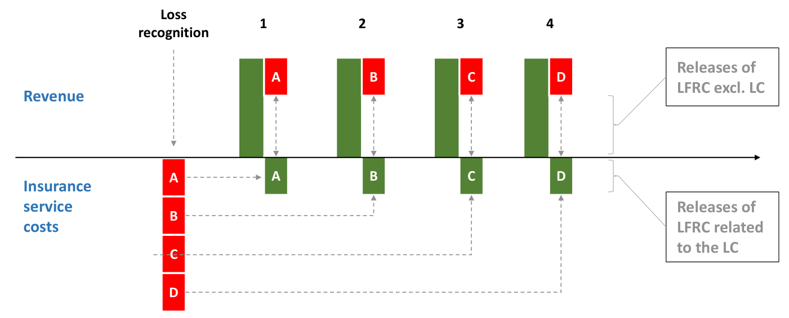
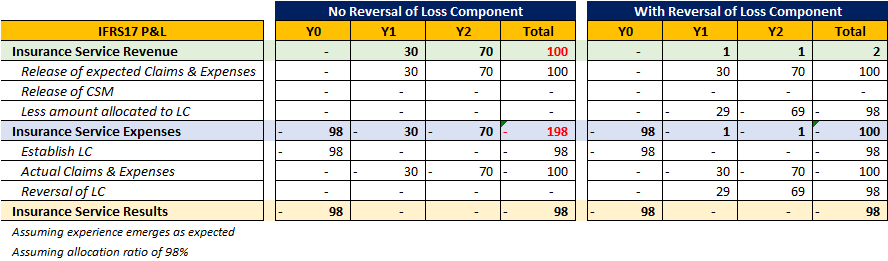

# **IFRS17 Overview**

## **Background**

IFRS stands for the **International Financial Reporting Standard**, which is a financial reporting framework to bring **transparency and consistency** to financial statements worldwide. IFRS17 is the set of standards that specifically cover the treatment of **insurance contracts**.

!!! Info

    There are two key IFRS standards for insurers:

    * **IFRS17** - Insurance Contracts (Liablities)
    * **IFRS9** - Financial Instruments (Assets)

    Both standards were designed to work in tandem with one another, thus they should be adopted together to prevent accounting mismatches between the two components.

It is important to have a clear **distinction** between the two common types of reporting:

* **Financial Reporting** - Provide **accurate and objective** information about the company in a **consistent** format to **external stakeholders** to facilitate their decision making.

* **Statutory Reporting** - Provide information about the company to **government authorities** to prove **compliance with relevant regulations**. Certain simplifications or materiality considerations are allowed for operational ease. Given that Solvency is a primary concern, a more **conservative lens** is taken.

Another broad concept to understand is that IFRS17 is a **Principle Based** framework. It outlines the **intended outcomes** of the framework, giving insurers the **flexibility to choose the method** in which they achieve the outcome. As such, there are **no prescriptive methods or amounts** outlined as they view them as creating arbitrage opportunities.

## **Scope**

IFRS17 is only applicable to **Insurance Contracts** - where the issuer (insurer) accepts **significant insurance risk** from another party (policyholder).

There are a few key terms that need to be defined:

* Contract

* Insurance Risk

* Significant  

Insurance contract definition >>
Contract is an agreement between two or more parties with enforceable rights and obligations

No longer required to provide coverage
No right to renewal

Discount rates

It is important to understand the **Contract Boundary** as well.

## **Presentation**

IFRS17 adopts the view that an insurance should be treated as both a **Financial Instrument** and a **Service Contract**:

* If it were only treated as a financial instrument, it should be valued at its **fair value** (to be consistent with existing IFRS frameworks); the price it would go for if it would be sold in an orderly transaction. However, insurance contracts are **rarely traded**, making such approaches based on **hypothetical scenarios**.

* Instead, insurance contracts are typically **held till expiry**, where insurers provide the stipulated benefits over time as agreed. Thus, it is also treated as a **service contract**, which is valued based on the **insurance services provided** over time. 

Thus, it splits the Income Statement into two key components:

* **Insurance Service Results** = Insurance Revenue - Insurance Service Expenses
* **Investment Results** = Investment Income - Insurance Finance Expenses
* * Allows external stakeholders to **better understand the different drivers** of the insurer's performance

<!-- From FRG Risk -->
{.center}

Most life insurance contracts tend to have **both an insurance and investment component** of the contract (EG. Fund Value in Unit-Linked contract). Based on the above split, it is **not appropriate** to include items relating to the investment component in the insurance service results; thus they should be **net out**.

However, the cashflows relating to insurance and investment components are often **highly interrelated and difficult to seperate**, thus IFRS17 defines them as:

* **Investment Component** - Amount that the insurer has to pay even if the insured event **does NOT occur**
* **Insurance Component** - *Additional* amount the insurer has to pay when the insured event **does occur**

Investment Components only need to be seperated at the **time of recognizing insurance revenue and expenses** (income statement). They can be combined for the purposed of contract measurement.

The intuition is that the investment component represents **deposits** that the insurer is **investing on behalf of the policyholder** that will eventually be returned to them, hence the amount **should not impact the income statement**. However, the **charges** set by the insurer for such investments does flow into the FCF and hence CSM/LC and **does impact the income statement**.

!!! Note

    There are two types of investment components under IFRS17:

    * **Distinct** - **Clearly seperated** from insurance components. Investment component measured **seperately under IFRS9** 
    * **Non-Distinct** - **Highly Interrelated** with insurance components. Measured **together under IFRS17**

A key impact of the above concepts is that premiums are **NOT considered under the insurance revenue**:

* Insurance revenue is based on expected **services provided**, not when cash is received
* Most premiums also contain a **non-distinct investment component** that will be repaid regardless, which is difficult to split out

Instead, the **reduction in liability**

## **Measurement**

IFRS17 uses the term *Measurement* when refering to the value of the contract. There are two key variations:

* **Initial Measurement**: Contract valued **at policy inception**
* **Subsequent Measurment**: Contract valued **post-inception**

An insurance contract is measured based on the **Fulfilment Cashflows** (FCF) of the contract, which incorporates the following components:

* Unbiased estimate of the future cashflows (neither conservative nor optimistic)
* Adjustment for the time value of money
* Adjustment for non-financial risk(s)
* Adjustment for financial risk(s)

Deposit cashflows

The above can then be summarized into three key components:

1. **Best Estimate Liability** (BEL) - Present value of the unbiased cashflows

2. **Risk Adjustment** (RA) - Present value of adjustment for non-financial (insurance) risks. It reflects the risk that actual experience might deviate from the best estimates.

3. **Cost of Guarantees** (COG) - Present value of the adjustment for financial risk. It reflects the risk that financial variables might cause embedded options and guarantees in the product becomes **in-the-money**.

!!! Warning

    Both BEL and TVOG are NOT officially defined terms under IFRS17; they were brought over from other valuation bases by the industry:

    * **BEL** - Officially defined under Solvency II
    * **TVOG** - Officially defined European and Market Consistent Embedded Values

!!! Warning

    Financial Risks are typically **accounted for implicitly** in the cashflows or discount rates. TVOG is typically the **only explicit adjustment**, hence it is emphasized above.

$$
    \text{FCF} = \text{BEL} + \text{RA} + \text{COG}
$$

The below sections on CSM and LC will be based on the defualt measurement method, known as the **General Measurement Approach** (GMA). However, there are other measurement methods that may be used under certain conditions which will be covered after. Unless otherwise stated in those sections, the mechanism should follow the same as the GMA.

### **Liability**

IFRS17 liability is split into two components:

* Liability for Remaining Coverage (LRC) - relating to **future insurance services**
* Liability for Incurred Claims (LIC) - relating to **past insurance services**

On initial measurement, all FCFs will flow to LRC as the contract is newly established.

On subsequent measurement, only changes to future FCFs (EG. assumption changes) will affect the LRC. Actual and expected FCFs that relate to past service (EG. most recent period) will flow in and out of the LIC.

It is important to remember that changes in the balance sheet come from two sources:

* Income Statement - Recognition of transactions
* Cashflow Statement - Actual transactions
* The two items are not always aligned. Thus, the net impact will change the holding liability.

<!—- From IFRS Foundation —-> 

### **Contractual Service Margin**

On **Initial Measurement**, if the FCF is **negative**, the insurer expects a **net inflow**; the contract is expected to be **profitable**. In this case, the insurer will set up a positive **Contractual Service Margin** (CSM) under the LRC:

$$
    \text{LRC} = \text{FCF} + \text{CSM} = 0
$$

<!-- Self Made -->
{.center}

The CSM effectively represents the **excess of inflows over outflows** and is a measure of the **unearned profit** of the contract. It is set-up to ensure that the expected profit from the contract is **NOT recognized immediately**. This follows the principle of a **service**, where profit should be **recognized each period** based on the amount of service provided. Thus, the **CSM is amortized each period**, released as **revenue** under the insurance service results.

<!-- Self Made -->
{.center}

On **Subsequent Measurement**, the CSM is adjusted BEFORE any release:

* **CSM accretes interest** based on the **initial discount rate**. This is to reflect the price of the service **at the time it is fulfilled** (time value effect). This is accounted for as an expense under investment results.

* CSM is adjusted for **changes in non-financial assumptions**. Given the inherent uncertain nature of the business, this is to reflect the insurers **latest expectation** of the business.

* Changes relating to **financial assumptions** (EG. Discount rate) are **NOT reflected in the CSM**. They will flow directly to the Insurance Finance Income line in the P&L.

!!! Note
    
    The CSM of a contract is essentially calculated using only the **discount rate at inception**, commonly referred to as the **Locked-In Rate** (LIR).

<!-- Obtained from IFRS Org -->
{.center}

### **Loss Component**

If on initial measurement, the **FCF is positive**, then the insurer expects to **make a loss** on the contract instead. In this scenario, the insurer will instead set-up a **Loss Component** (LC) in the LRC instead. However, it is **IMMEDIATELY** recognized as an **expense** under the insurance service results. It is NOT a "negative CSM" that recognizes losses over time. This **asymmetric** treatment of profits and losses is a key concept in IFRS17.

Unlike CSM, the LC does not smoothly fit into the LRC; it is carved out of the existing LRC:

$$
    \text{LRC} = \text{LC} + \text{LRC excl LC}
$$

<!-- Self Made -->
{.center}

The LC is subsequently **reversed** such that it becomes zero by the end of the contract term. While this sounds similar to CSM, the **direction and mechanics** of flow is different:

* **CSM Amortization** - CSM **released** from B/S to revenue in P&L
* **LC Reversal** - Portion of revenue is **re-allocated** as an expense that will flow to B/S to reduce the LC  

Unlike CSM, the reversal of the LC has **NO impact on the total insurance service results**. It reflects that the loss has already been **incurred at inception** and thus relevant items relating to it should be **excluded in subsequent periods**. It ensures that the revenue and expenses presented are **sensible**; otherwise, they will be **overstated**.

* The reversal reduces BOTH the revenue and expense (neutral impact)
* IFRS17 states that the reversal must be done **systematically**, with relation to the expected claims, expenses & RA release

<!-- Obtained from 3Blocks -->
{.center}

<!-- Self Made -->
{.center}

!!! Tip

    A contract can switch between CSM and LC if its profitability changes. The initial CSM/LC must **first be reduced to 0** then any **excess** amount will be allocated to the new LC/CSM.

### **Variable Fee Approach**

The Variable Fee Approach (VFA) is allowed for **Direct Participating Contracts**, which have the following three key characteristics:

1. Contract **participates** in the return of a **clearly identified** pool of assets
2. Policyholders are expected to receive a **substantial share of said return**
3. Policyholders are expected to receive a **substantial share of the variation** of any change in asset return

### **Modified General Measurment Approach**

IFRS17 typically covers the **entity that issues** the insurance contract; not the owner of the contract itself. Thus, Reinsurers also account for their reinsurance contracts using IFRS17 as they are the contract issuer. However, the **owners of reinsurance contracts** also have to account for them under IFRS17. These are known as **Reinsurance Contracts Held** (RCH).  

RCH are considered **seperate contracts** from the underlying insurance contracts, thus are accounted for seperately from them as well. In other words, RCH **does NOT reduce the liability** of the underlying contract. The insurer is still **fully liable for the services provided to the policyholders**; RCH provide indemnity to the insurer for the services.

IFRS1

RI premium
RI Ceding Commission  - Expense allowance for UW etc

RCH is usually an sset and paying toRI

Adjust for recits risk of the insurer

RI is an asset w recoverable
negative CSM
reflecting ceded the deferred profit to the RI
RI is an expense

Reinsurance contracts held cannot be onerous
Views them as a net cost or gain when buying insurance

### **Premium Allocation Approach**

### Aggregation

The fundamental principle of insurance is **risk pooling** - where the insurer issues a large number of **similar contracts**, where on average, the claims in any given period will be close to the expected value. Thus, contracts should be **measured in groups** to better reflect this.

However, since profit and losses are treated **asymetrically**, it is important **not to mix the two** together as there might be offsetting effects where **information is lost**:

* **Onerous** at recognition
* **Not onerous** at recognition and **no significant possibility** of becoming onerous
* **Others** - Not onerous but with possibility of becoming onerous

The possibility of becoming onerous should be assessed internally based on:

* **Expected Profitability** - Highly profitable contracts have a **larger margin to absorb** adverse changes
* **Sensitivity** - Contracts **sensitive to certain assumptions** have a higher likelihood of turning onerous

!!! Tip

    The profitability assessment can be done at an **individual** contract level or as a **set** of contracts.

    In order to take the simplified set approach, there must be sufficient **reasonable supporting information** to prove that all contracts in the set will have the **same profitability** (no offsetting effects).

In totality, there are **three levels of aggregation**:

* **Portfolio** - Contracts with **similar risks** which are managed together (EG. Participating Whole Life, Universal Life)
* **Group** - Contracts with similar levels of profitability
* **Cohort** - Contracts **issued within one year** from one another, allowing **changes in profitability** of the business to be observed over time

!!! Warning

    Once the contracts are aggregated at initial recognition, **no changes** to the level of aggregation of the contract may be made - even if the contract subsequently changes profitability.
    
    The only exception is when there are **changes to the contract itself**, then the groupings for the contracts may be re-assessed.

!!! Tip

    For new business, contracts will be **added to the cohort** until one year from the issuance of the first policy - at which the cohort becomes **closed**.

<!-- Self Made -->
{.center}

CSM, LC and other key components will be **reported at the level of aggregation** described above. The underlying FCF that is used for measurement can be done at any level, though it is typical to use the **most granular contract level** approach.
