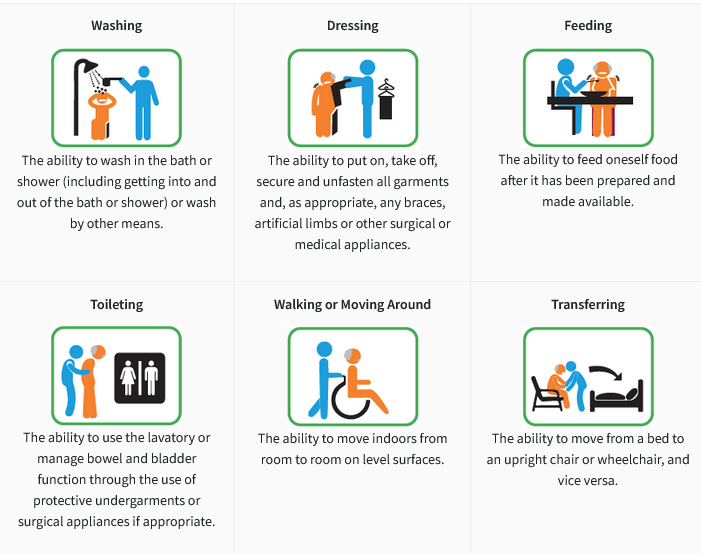
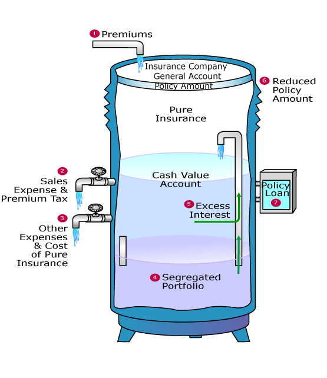

# **Life Products**

This section is meant to provide an **overview of the key features** of the different types of life insurance policies and their common variations.

## **Product Type**

There are several types of insurance that fall under the "Life" category. All of them insure against **risks associated with the human life**.

This section will focus on the **key ideas** behind each type of product. It is NOT meant to cover the specific mechanics of how each product functions.

Note that not all of the product types mentioned below are offered as a standalone product. Some are often **combined with regular life insurance** or offered as an **optional rider** to a regular life insurance plan. 

### **Life Insurance**

Life Insurance is a contract whereby the insurer will pay out a benefit to the **beneficiary** if the policyholder **dies** or becomes diagnosed with **Terminal Illness**.

Individuals who **die earlier than expected** leave their dependents (who have yet to become financially independent) without financial support. Thus, life insurance helps to provide:

* **Income Replacement**: Replaces the income that would have been earned by the insured; allowing their dependents to maintain their current lifestyle
* **Debt Repayment**: Covers outstanding debts of the family (EG. Home Mortgage)

There are also **expenses associated with death** (EG. Hospice, Funeral). The benefit payout can also be used to **cover these expenses**, ensuring that **no financial burden** was left onto their family.

### **Total Permanent Disability**

Total Permanent Disability (TPD) insurance is a contract whereby the insurer will pay a benefit to the insured in the event that they become **totally and permanently disabled**.

Most insurers use the some variation of the below definition for TPD:

* The **inability** to engage in *any* paid work
* **Irrecoverable** physical loss - loss of sight in both eyes, loss of two limbs or a loss of sight in one eye and loss of one limb

Individuals who have TPD can **no longer work**. Thus, TPD insurance similarly provides **Income replacement** and **Debt Repayment** coverage for the beneficiaries of the insured.

They also incur **additional expenses** that can be covered with the benefit pay out:

* **Medical Expenses**: Healthcare costs not covered by Health Insurance (Due to nature of treatment or coverage limit)
* **Non-Medical Expenses**: Cost of home modifications or assistive devices to aid living with TPD (EG. Wheelchair ramps or Communication aids)

Since the benefit can be used to cover necessary expenses, it ensures that **no financial burden** falls upon the family of the insured. Additionally, it also **preserves their own financial resources**, allowing them to be used for their intended purposes (EG. Retirement or Children's Education).

!!! Note

	The above point can be made for all remaining products types that trigger a payout while the insured is still alive.

### **Critical Illness Insurance**

Critical Illness (CI) Insurance is a contract whereby the insurer will pay out a benefit to the **policyholder** if they become diagnosed with a qualifying **critical illness**.

In Singapore, there are a list of **37 CIs with a standardized definition** across the industry. Insurers are then free to provide coverage for addittional CIs based on their own definitions.

Individuals who become diagnosed with critical illness typically become **unable to work** as they require treatment. Thus, CI insurance similarly provides **Income Replacement** and **Debt Repayment** coverage for the beneficiaries of the insured during the downtime.

Similar to TPD, CI insurance can cover **out of pocket expenses** that are **not covered by health insurance**:

* **Medical Expenses**: Alternative therapies for rare variations of illness
* **Non-Medical Expenses**: Cost of transport & accomodation for out of town treatments

!!! Warning

	It is a common misconception that CI insurance is needed to cover the cost of treatment - that should be covered by health insurance.

	However, due to the ever evolving nature of CI and medical technology, some **rare diseases** or **new treatments** might not be covered by health insurance.

### **Long Term Care Insurance**

Long Term Care Insurance is a contract whereby the insurer will make **routine payments** to the insured for as long as they are **Severely Disabled**.

Most insurers use the following definition for Severe Disability - the **inability to INDEPENDENTLY perform** one or more **Activities of Daily Living** (ADL):

<!-- Obtained from Careshield Life website -->

Individuals who are severely disabled cannot live indepedently and thus **require long term care**. Thus, the main purpose of LTC insurance is to **cover expenses for LTC services** such as the cost of assisted living facilities or in-home nursing.

### **Disability Income Insurance**

Disability Income Insurance is a contract whereby the insurer will make a **routine payment** to the insured for as long as they are **disabled and unable to work** due to sickness or injury.

There are different definitions of disability, depending on the nature of the job that the insured is unable to perform:

* Unable to perform current job
* Unable to perform any job suited to their experience and education
* Unable to perform any job

!!! Warning

	The are three main types of disability insurance that are commonly confused with one another. One intuitive way to differentiate them is based on the **severity of disability covered**:

	* **Disability** - Disability Insurance
	* **Severe Disability** - Long Term Care Insurance
	* **Total Permanent Disability** - TPD Insurance

### **Life Annuities**

A Life Annuity is a contract whereby the insurer will make **routine payments** to the insured for as long as they are alive during the payment period.

Individuals who **live longer than expected** might not have sufficient financial resources to survive. Thus, the annuity payments are meant to **cover essential living expenses**, ensuring the insured is able to age gracefully.

!!! Info

	Life annuities are the natural complements to life insurance - one hedges the risk of dying too early while the other against the risk of dying too late.

## **By Premium Payment Term**

The easiest method of categorizing life insurance policies is via their **Premium Payment Term**. It refers to **how long premiums must be paid** to keep the policy active.

There are three states that a policy can be in:

* **In-Force** - Required premiums have been **paid** and will remain active **till the next premium due date**
* **Lapsed** - Required premiums **have NOT been paid** and will become inactive from then on
* **Paid Up** - **ALL** required premiums **have been paid** and will remain **active for the remaining duration of the policy**

!!! Info

	There is usually a **grace period** of about 1 month for the insured to make the required premium payment **after the premium due date**.

	Most insurers allow a lapsed policy to be **Reinstated** within a **specified window** after it has lapsed. It typically involves paying the **outstanding premiums** since lapse.

	However, reinstatement is **not guaranteed**. Some insurers may require the individual to go through **medical underwriting** again. In such cases, the terms of the policy may be adjusted if the insured's condition has worsened.

### **Regular Premium (RP)**

A **Regular Premium** policy must have premiums paid at **regular intervals** for the policy to remain in-force.

From an

Regardless which choice is chosen, the total premiums required are the **same from an actuarial perspective**. Thus, regular premiums tend to have the **smallest magnitude**.

This option is suited for individuals who have a **steady stream of income** and are thus able to **spread the cost** of insurance over an extended period of time.

### **Single Premium (SP)**

A **Single Premium** policy only needs to have premium paid **once** on inception. The policy becomes **paid up** from that point on.

Naturally, single premiums would have the **largest magnitude** as the entire premium is being paid upfront.

This option is suited for individuals with a **large amount of liquid assets** (typically obtained via a windfall) and are thus able to **secure the insurance coverage** in a single payment.

### **Limited Pay (LP)**

A **Limited Pay** policy is a mixture of the above:

* Premiums must be paid at **regular intervals for a fixed period**; premiums must be paid for the policy to remain in-force during this period
* After that period, the policy is **paid up from that point on**
* Premium size tends to be **significantly larger** than regular premiums

The required period could be defined in two ways:

1. **Explicit** - Payments required for a **fixed number of years** (EG. 20 years) 
2. **Implicit** - Payments required **till a certain age** (EG. Till age 65)

This option is suited for individuals who either:

* Have **unreliable** streams of income; cannot afford to spread the cost
* Have **high income**; can afford to pay the higher premiums

### **Premium Mode**

The **frequency** at which premiums are paid is known as the **Premium Mode**. For most policies, premiums are to be **paid annually** by default.

However, most insurers offer the option to pay premiums on a **more frequent basis** instead to suit individuals with different needs - **Semi-Annually**, **Quarterly** or **Monthly**.

Generally speaking, premiums **paid more frequently have a slightly higher magnitude** when compared on the same basis:

<!-- Obtained from Understanding the Actuarial Practice -->
{.center}

This is due to reflect the **higher cost** to accomodate more frequent payments:

* **Opportunity cost of interest** due to premiums being received later
* **Higher expenses** due to increased billing and processing

!!! Warning

	A common misconception is that paying a higher premium would contribute more to the cash value of the policy.

	The additional costs are entirely to reflect higher costs; **insurers are typically indifferent** between payment modes as the amount going to the insurance portion remains the same.

## **By Policy Term**

Another intuitive method of categorizing life insurance policies is via their **Policy Term** - how long the insurance coverage will last.

### **Term**

Term policies offer insurance coverage for a **specified period** - a fixed number of years or till a specified age.

If the insured does not occur during the policy term, then the policy will expire and **nothing will be paid out**. Thus, it is suited for individuals with **financial obligations for a limited period** - EG. Till their children become financially independent.

Term policies typically have **lower premiums** due to the following reasons:

1. There is a **possibility of not receiving a payout**
2. Product features are simpler and **easy to compare**, making it more **price competitive**

### **Whole Life**

Whole Life policies offers permanent coverage for the **entire lifetime** of the insured.

!!! Note

	Technically speaking, there is an **upper limit** to the coverage, known as the **Maturity Age**:

	* It is the age whereby the insurer **assumes all individuals will die** (EG. Age 120)
	* If the insured survives till this age, then the policy will **mature** and benefit will be paid out to the insured
	* This is because the product was priced based on the expectation that a payout would be made by this age. Thus, it is only fair that the insurer actually makes the payout

Since **death is inevitable**, the insurer will **surely make a payout** on the policy. Thus, it is suited for individuals who **want to leave a bequest** for their beneficiaries. 

!!! Info

	Since the death payment is **guaranteed**, the face amount is referred to as the **Sum Assured**. This is why this type of policy is also known as a **Life Assurance**.

The defining feature of a whole life policy is that it accumulates capital within the policy (similar to a savings account), known as the **Cash Value** of the policy. It can be accessed partially or in full via withdrawals, loans or a full surrender of the policy.

The intended purpose of cash values was to create a **comprehensive financial product** with both an **insurance and savings component**, reducing the need to get each individually. It also offered a **structured approach** to saving as premiums must be paid routinely, **forcing** the insured to save.

### **Endowment**

Endowment Insurance offers coverage for a **fixed period** but also has a **cash value** component. It is intended to be a **saving oriented product** with limited insurance coverage.

The intended goal is for the policy to mature and payout the maturity benefit, which can be used to fund specific financial goals at known points in time such as funding education expenses or purchasing a home.

In Singapore, they typically come in one of two variations:

|         Type          |   **Short Term**   |      **Long Term**       |
| :-------------------: | :----------------: | :----------------------: |
| **Benefit Structure** | Non Participating  |      Participating       |
|   **Selling Point**   | Capital Guaranteed | Prospect of high returns |

## **By Benefit Structure**

### **Non-Participating**

A **Non-Participating Policy** is one that only has **guaranteed benefits**.

Non participating term policies are **entirely protection based**, ideal for policyholders who do not wish to mix protection with savings/investments.

<TBC on the other>

### **Participating**

A **Participating Policy** is one that **participates in profit sharing** with the insurer. As such, they are also commonly referred to as a "With-Profits" policy.

The premiums from all participating policies are pooled together into a **Participating Fund** managed by the insurer. The fund is used to support the operations of the policies (expenses and benefits), where the remaining balance is invested with the goal of generating **stable long-term returns**.

Every year, the health of the participating fund is measured based on its ability to support future benefit payments and profit sharing. The excess can be understood as the "Profit" of the participating fund, which is shared with policyholders in the form of a **Bonus**.

Bonuses are often referred to as **Non-Guaranteed** benefits as the performance of the participating fund is not guaranteed.

The key selling point of a participating policy is that there are **limited downside risks**:

* Guaranteed benefits will be received **regardless** of the performance of the par fund
* Declared bonuses are guaranteed and will be received **regardless of the future performance** of the par fund
* Bonus declaration can only be positive; losses are NOT shared

### **Universal Life**

A **Universal Life** policy is one that offers **flexibility** to the policyholder, allowing them to effectively design their policy. The **wide range of options** available to the policyholder is why it is called "Universal".

Each policy has a **cash account** built into it:

1. Premiums are paid into the account
2. Insurance and expense charges are deducted
3. Interest is credited to the account based on the rate earned by the insurer

!!! Note

	There is typically a **minimum guaranteed rate** that the insurer will credit regardless of the performance of their investments to ensure that the cash account will grow.

<!-- Obtained from broad ridge advisors -->
{.center}

The following options can be changed by the policyholder:

* **Premiums**: Size and frequency of premiums
* **Sum Assured**: Size can be changed (subject to underwriting)
* **Interest**: Credited rate can be tagged to another source (Index or Mutual Funds)

The cash value of the policy can be accessed via a withdrawal or loan. However, if the cash account **reduces to zero** (due to insufficient premiums or interest) then the policy will **lapse**.

The key selling point of a UL policy is its **flexibility** to meet a wide variety of needs.

### **Unit Linked**

A **Unit-Linked** Policy is one that **invests the premiums** into **unit trusts** of professionally managed **mutual funds** of the policyholder's choice. This is why they are also commonly referred to as an **Investment-Linked Policies** (ILP).

Each policy has a **unit account** that stores the purchased units. The account value is the **total NAV** of the units at the time.

The unit account is conceptually similar to the cash account of a UL policy:

1. Premiums are used to purchase units of chosen funds
2. Units are sold to pay off any insurance or expense charges

The account value can be accessed via a withdrawal or loan, through the **sale of the units** at the prevailing NAV. Similarly, if the account value **reduces to zero** due to poor market conditions, the policy will **lapse**.

There are generally two types of ILPs, which determines how the death benefit is structured:

|         **Protection Focused**          |             **Investment Focused**              |
| :-------------------------------------: | :---------------------------------------------: |
|             Has sum assured             |            Does NOT have sum assured            |
| Higher of account value and sum assured | Higher of account value and total premiums paid |

The key selling point of an ILP is that it is able to **generate high returns**, allowing it to **overcome inflation** which has typically plagued the other types of insurance policies. 

Unlike all other forms of insurance, there are **NO investment guarantees**. The policyholder bears ALL the **investment risk**. If the underlying funds perform badly, the account value could decrease and result in a loss for the policyholder.

## **Consumer Considerations**

### Buy term & invest the rest

The key idea is that you do not need to have coverage for your entire life – At some point, your dependents will grow up and become financially independent. They do not need the extra windfall from life insurance

Another reason is that the payoffs from Par Products or ILPs are generally poor – if you invested the additional money you paid for those products vs Term Insurance in a market index fund, you would get much better results

A decent amount of the premiums in the first few years goes towards commission for the intermediaries – which means that the compounding effect kicks in much later

However, for people who can’t be bothered to learn simple investing or do not have the discipline to invest, insurance investments may not be a bad choice

### The Argument for Whole Life

Although our dependents may become financially independent, most would like to leave a something behind for their children once they are gone, thus they would like to be covered till the very end

Another key reason is that the policyholder only needs to go through Medical Underwriting ONCE. If your health worsens later on in life, it will not negatively affect premiums, and everything will still be covered. Thus, it is good to buy whole life insurance while you are young & healthy
This is in contrast to a case whereby you purchase cheap term insurance for X years, but after X years your health deteriorates, and you would like to renew but it suddenly becomes very expensive
